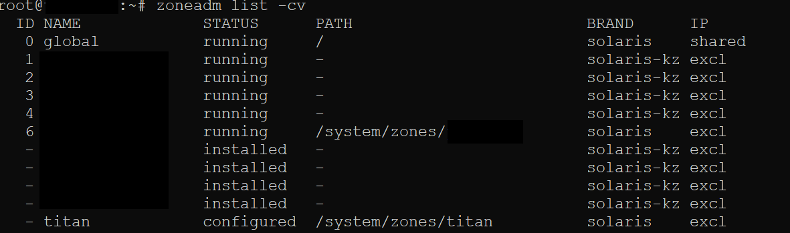
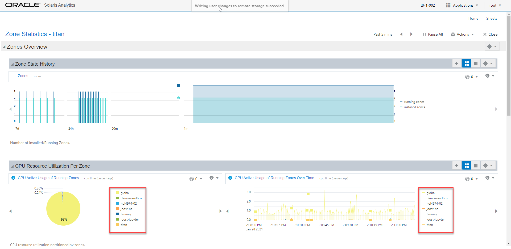
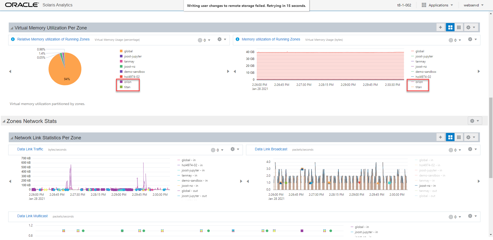
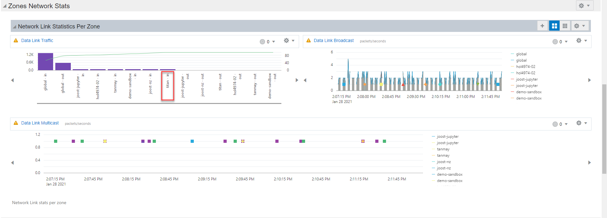
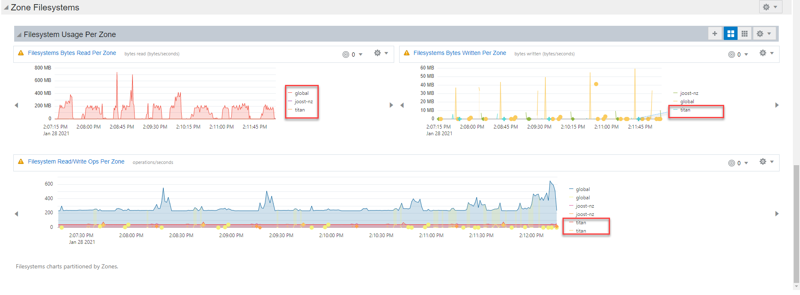

# Zones Sheet

The Zone Statistics sheet helps users have an end-to-end oversight of their zones, the resources being utilized and perform root cause analysis in case of failure. For our demo, we will create a zone to understand how the zones sheet helps us analyze the impact on the resource utilization.

------

## Understanding the components of the Zones Statistics sheet:

### 1. Zone Overview	

With the Zone Overview section, users can have an insight into running/installed zones, current CPU resource utilization and virtual memory utilization of running zones.

### 2. Zone Network Stats

The Zone Network Stats enables users to understand the impact of running/installed zones on the network.

### 3. Zone Filesystems

The Zone Filesystems show the filesystem usage per zone providing graphical insights into the active read/write operations across every zone.

------

## Creating a zone to understand how the Zone Statistics sheets functions 

### 1. Creating a zone

Oracle Solaris 11 places Oracle Solaris Zones technology at its core, integrating Oracle Solaris Zones with key Oracle Solaris 11 features. For example, tight integration with the new software management architecture makes deployment of Oracle Solaris 11 and Oracle Solaris Zones easy. Refer to this [article](https://www.oracle.com/technical-resources/articles/it-infrastructure/o11-092-s11-zones-intro.html) to understand how zones are created and configured.

For our use case, we have created a zone "titan", to analyze the impact on the system.

### 2. Impact on  the system

### - Zone State and CPU Utilization

### - Virtual Memory Utilization

### - Network Stats

### - Zone Filesystems

------

The Zone Statistics sheet forms a part of the Oracle Solaris Continuous Delivery model and we will continue sharing new   innovations happening in this space

Copyright (c) 2021, Oracle and/or its affiliates. Licensed under the Universal Permissive License v 1.0 as shown at https://oss.oracle.com/licenses/upl/.

