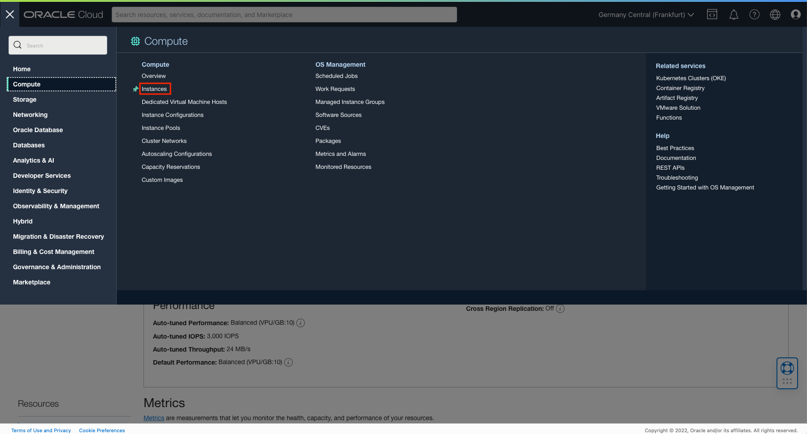
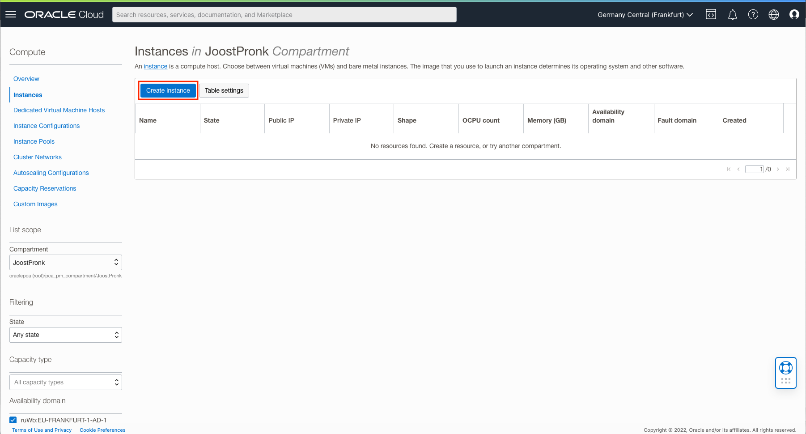
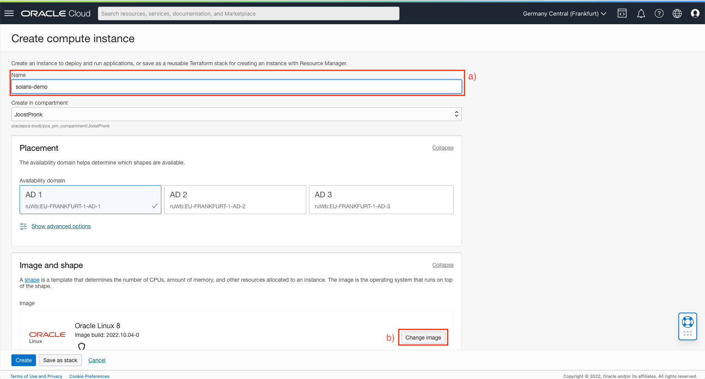
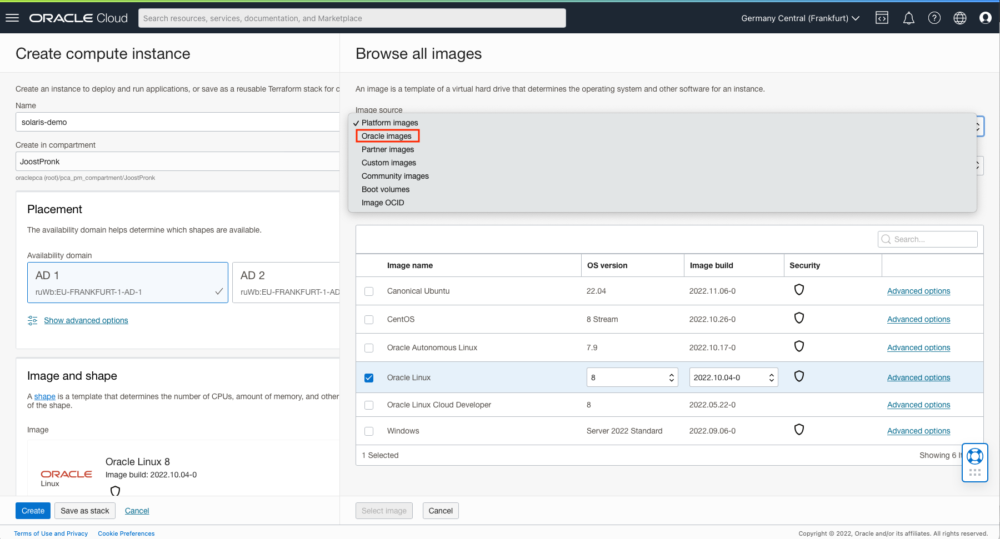
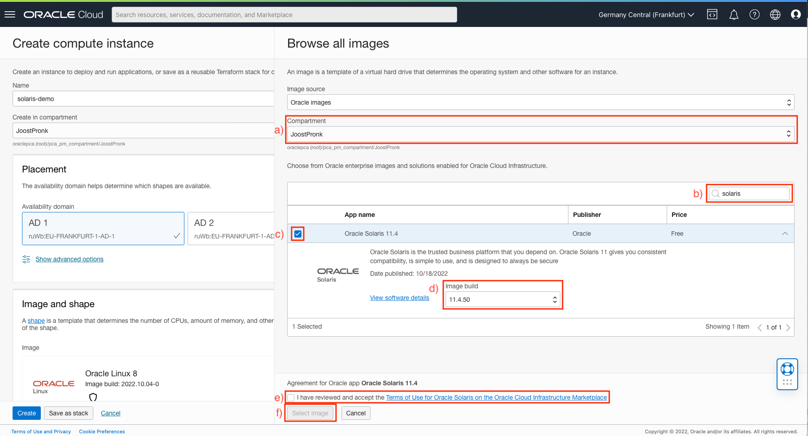
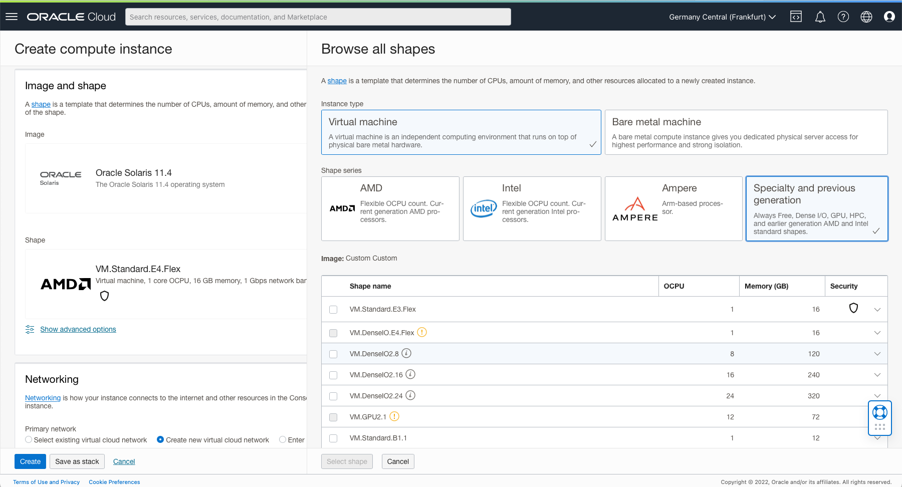
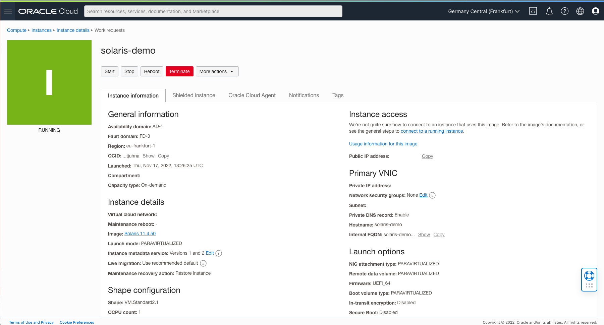

# Launching an Oracle Solaris Instance on Oracle Cloud Infrastructure from the Instances Page

Oracle Cloud Infrastructure Compute lets you provision and manage compute hosts, known as **instances** . You can launch instances as needed to meet your compute and application requirements. After you launch an instance, you can access it securely from your computer, restart it, attach and detach volumes, and terminate it when you're done with it. Any changes made to the instance's local drives are lost when you terminate it. Any saved changes to volumes attached to the instance are retained.

Since October 2019, [Oracle Solaris 11.4](https://www.oracle.com/solaris/technologies/solaris11-overview.html) images have been available for download from the [Oracle Cloud Infrastructure(OCI)](https://www.oracle.com/cloud/) Marketplace. With Solaris now in the cloud, customers can benefit from Solaris instances running on x86 architecture. This article is a walkthrough on how to launch an Oracle Solaris instance from the Instances page in the Compute section in the OCI BUI known as the [*Oracle Cloud Console*](https://docs.oracle.com/en-us/iaas/Content/GSG/Concepts/console.htm), the [other article](Launch_through_Marketplace.md) shows how to launch an Oracle Solaris instance from the OCI marketplace.

Note: *Images in this document have been captured on 17th November 2022.*

## Oracle Solaris 11.4 on OCI: Installation

------

All the following actions will be done in the Oracle Cloud Console. It presumes you have a tenancy, a compartment, and a VNC and subnet already set up.

### Step 1: Accessing the Instances page

To get to the Compute *Instances* page in the Oracle Cloud Console do the following actions:

After logging in to the Oracle Cloud Console, you can find the *Instances* page by clicking on the hamburger menu icon on the left. After you select *Compute*, you can then click on *Instances*. This should bring you to a page that looks like this:

To launch an instance click on the *Create instance* button.

### Step 2: (Optional) Choose a name for your instance

The first (optional) step is to choose a name for the new instance, **a)** in the following screenshot. There is a default name so you can also skip this step.

### Step 3: Choose the Oracle Solaris image

Click on *Change image*, **b)** in the previous screenshot, and this will open the Browse all images pane. As the Oracle Solaris image is available from the OCI Marketplace you will need to choose *Oracle images* from the dropdown menu. See the next screenshot:

Once the list of Oracle images has loaded make sure the compartment you want to launch the instance in is selected—**a)** in the following screenshot—and then search for the Oracle Solaris image by filling in "Solaris" in the *Search...* box on the right above the list of images—**b)** in the same screenshot. 

 This should bring up the Oracle Solaris 11.4 image. Click on the checkbox on the lefthand side of the image to select it—**c)**.

The Oracle Solaris 11.4 image entry has a dropdown menu listing the latest Oracle Solaris images—**d)**. Note, these will work on both VM and BM shapes. The latest available Oracle Solaris version will be the default, but there are options to run older versions. The versions available are the very first version—which still had a different image for VM and BM shapes—and the latest versions going back a year. When a new SRU update is available for Oracle Solaris on OCI, it will be added to the list as an option for your use and the oldest of the recent images will be dropped.

Once you choose your preferred version of the Oracle Solaris image, you can then agree to the [terms and conditions](https://cloudmarketplace.oracle.com/marketplace/content?contentId=58993511&render=inline) and click Launch Instance—**e)**. For our walkthrough, we have chosen the default image.

Now click on *Select image* to go back to the main page—**f)**.

### Step 4: Choose a shape

Another important choice you can make is to choose the underlying shape on which you wish to run the image. The current default shape that OCI offers is the VM.Standard.E4.Flex with 1 core OCPU, 16 GB memory, 1 Gbps network bandwidth. But you can choose a preferred shape by clicking the *Change shape* button.

For our demonstration, we are using an INTEL Skylake VM.Standard2.1 with 1 core OCPU, 15 GB memory, 1 Gbps network bandwidth you can find in the *Specialty and previous generation* section.

#### Step 5: Choose your VCN and Subnet

In the *Networking* section check if the correct Primary network (VNC) and Subnet are selected. If they aren't use the dropdown menus to select the correct ones,

#### Step 6: Configure the SSH keys

After you choose your preferred shape and check the networking settings, you must save the Private and Public Keys(SSH Key Pairs) to your instance or you can choose to select your own pair—**a)** in the following screenshot. If using the auto-generated, SSH key pair, it is critically important to save the Private keys as it cannot be accessed later.

#### Step 7: Launch the instance

Once you click Create—**b)** in the screenshot above, OCI will provision and your instance will be up and running in a few seconds. Additionally, you can also find your public IP address from the Instance Information to connect to your instance using SSH. For more information on how to connect to a running instance, [click here](https://docs.oracle.com/en-us/iaas/Content/Compute/Tasks/accessinginstance.htm).

Once you are connected to your instance as an opc user, you can then choose to install additional software from the Oracle Solaris Support Repository. Note that on first boot after provisioning it may take a bit longer because Oracle Solaris will initiate its SMF services before letting you log in.  

Refer to the [Oracle Solaris Blog](https://blogs.oracle.com/solaris/), to learn more.

Copyright (c) 2022, Oracle and/or its affiliates. Licensed under the Universal Permissive License v 1.0 as shown at https://oss.oracle.com/licenses/upl/.