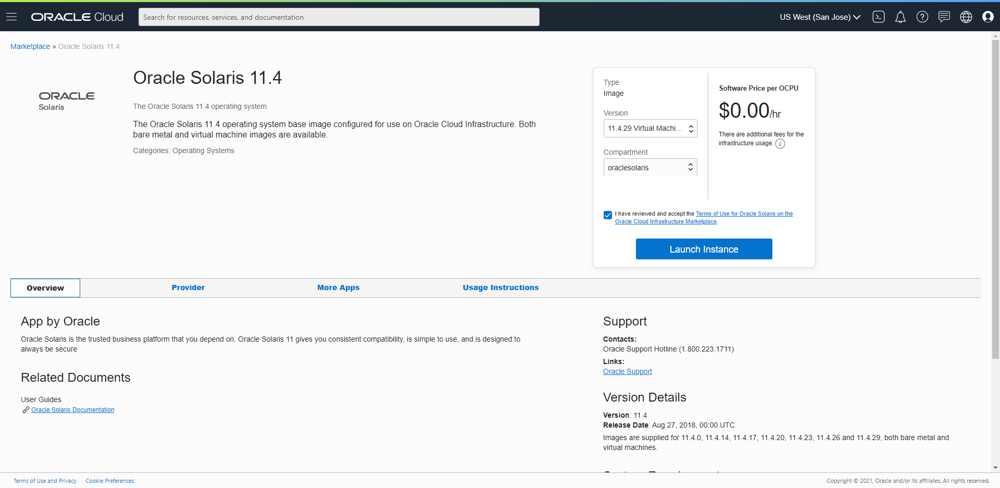
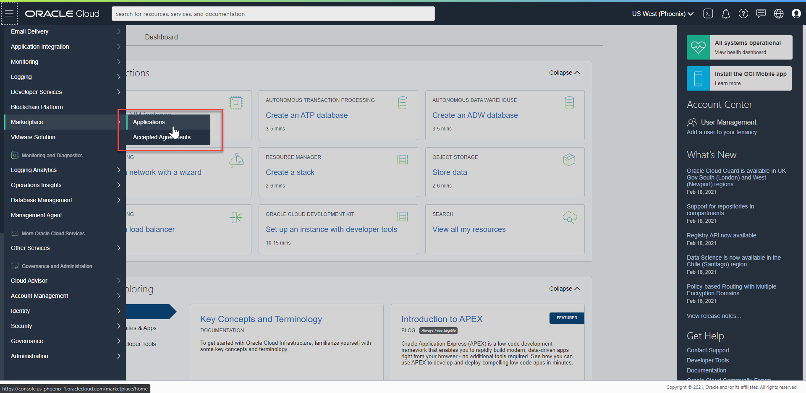
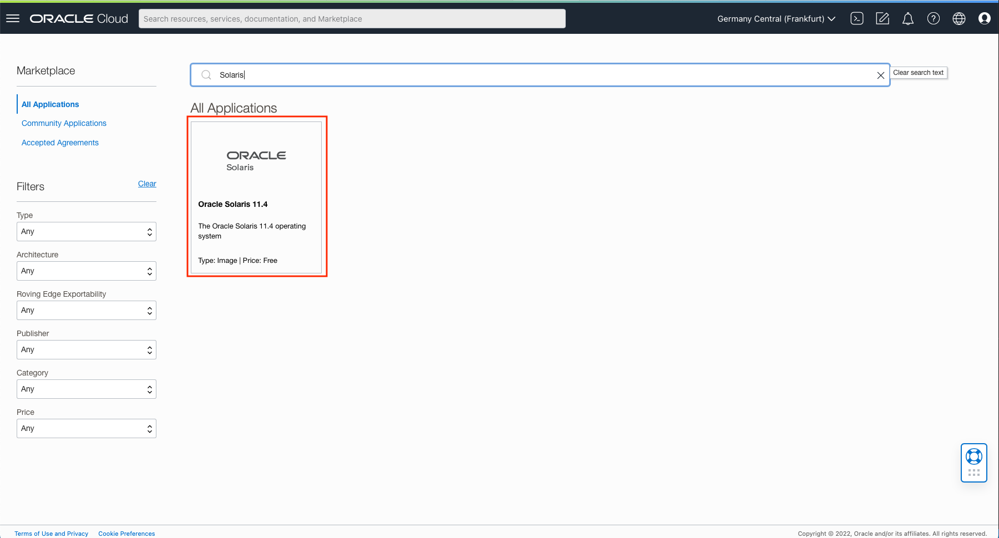
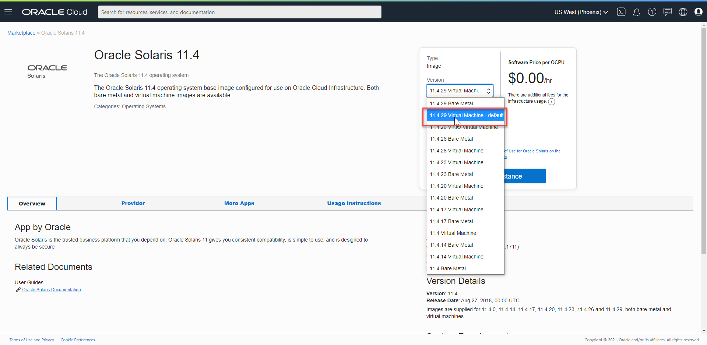
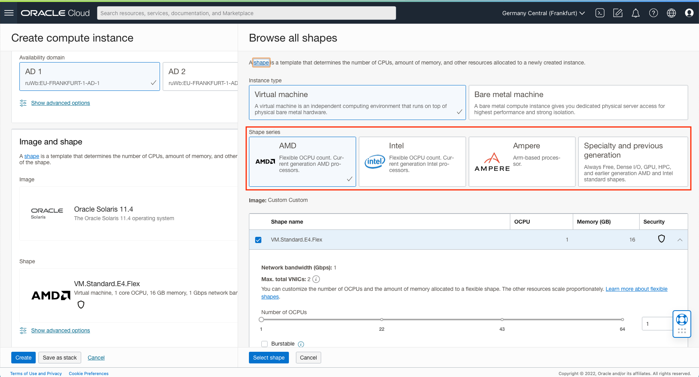
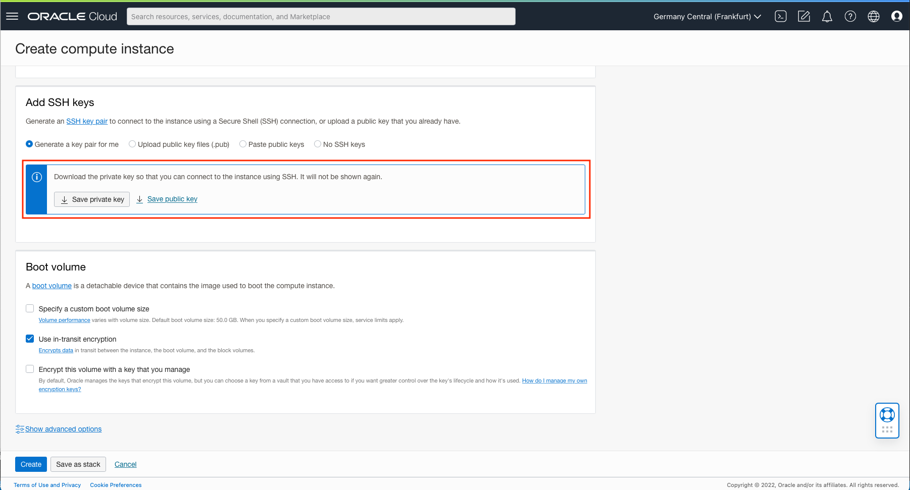
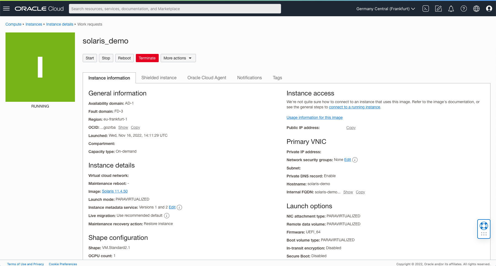

# Launching an Oracle Solaris Instance on Oracle Cloud Infrastructure from the Marketplace

Oracle Cloud Infrastructure Compute lets you provision and manage compute hosts, known as **instances** . You can launch instances as needed to meet your compute and application requirements. After you launch an instance, you can access it securely from your computer, restart it, attach and detach volumes, and terminate it when you're done with it. Any changes made to the instance's local drives are lost when you terminate it. Any saved changes to volumes attached to the instance are retained.

Since October 2019, [Oracle Solaris 11.4](https://www.oracle.com/solaris/technologies/solaris11-overview.html) images have been available for download from the [Oracle Cloud Infrastructure(OCI)](https://www.oracle.com/cloud/) Marketplace. With Solaris now in the cloud, customers can benefit from Solaris instances running on x86 architecture. This article is a walkthrough on how to launch an Oracle Solaris instance from the OCI Marketplace, the [other article](Launch_through_Instances.md) shows how to launch an Oracle Solaris instance from the *Instances* pane in the OCI BUI known as the *OCI Console*.

Note: *Images in this document have been captured on 14th November 2022.*

## Oracle Solaris 11.4 on OCI: Installation

------

A set of Oracle Solaris images is available in the the OCI Marketplace.

### Step 1: Accessing the OCI Marketplace

To get to the *Marketplace* pane in the OCI Console do the following actions:

After logging in to the OCI Console, you can find the OCI Marketplace by clicking on the hamburger menu icon on the left. After you select Marketplace, you can then click on *All Applications*. In the All Applications directory, you can use filters to help find the Oracle Solaris listing, as in this screenshot:

Clicking this should bring you to the Oracle Solaris page on the Marketplace.

### Step 2: Launching an Oracle Solaris 11.4 instance

For Oracle Solaris 11.4, the OCI Marketplace has a dropdown menu listing the latest Oracle Solaris images. Note, these will work on both VM and BM shapes. The latest available Oracle Solaris version will be the default, but there are options to run older versions. The versions available are the very first version—which still had a different image for VM and BM shapes—and the latest versions going back a year. When a new SRU update is available for Oracle Solaris on OCI, it will be added to the list as an option for your use and the oldest of the recent images will be dropped.

Once you choose your preferred version of the Oracle Solaris image and your compartment, you can then agree to the [terms and conditions](https://cloudmarketplace.oracle.com/marketplace/content?contentId=58993511&render=inline) and click Launch Instance. For our walkthrough, we have chosen the default image.

### Step 3: Configuring the instance

Once you click Launch Instance, you are directed to the Create Instance page where in the *Placement* section you can choose your Availability Domain and preferred [Fault Domain](https://docs.oracle.com/en-us/iaas/Content/General/Concepts/regions.htm#fault). Another important choice you can make is to choose the underlying shape on which you wish to run the image. The current default shape that OCI offers is the VM.Standard.E4.Flex with 1 core OCPU, 16 GB memory, 1 Gbps network bandwidth. But you can choose a preferred shape by selecting the Change Shape option.

For our demonstration, we are using an INTEL Skylake VM.Standard2.1 with 1 core OCPU, 15 GB memory, 1 Gbps network bandwidth you can find in the *Specialty and previous generation* section. After you choose your preferred shape, you must save the Private and Public Keys(SSH Key Pairs) to your instance or you can choose to select your own pair. If using the auto-generated, SSH key pair, it is critically important to save the Private keys as it cannot be accessed later.

### Step 4: Instance Details

Once you click Create, OCI will provision and your instance will be up and running in a few seconds. Additionally, you can also find your public IP address from the Instance Information to connect to your instance using SSH. For more information on how to connect to a running instance, [click here](https://docs.oracle.com/en-us/iaas/Content/Compute/Tasks/accessinginstance.htm).

Once you are connected to your instance as an opc user, you can then choose to install additional software from the Oracle Solaris Support Repository. Note that on first boot after provisioning it may take a bit longer because Oracle Solaris will initiate its SMF services before letting you log in.  

Refer to the [Oracle Solaris Blog](https://blogs.oracle.com/solaris/), to learn more.

Copyright (c) 2022, Oracle and/or its affiliates. Licensed under the Universal Permissive License v 1.0 as shown at https://oss.oracle.com/licenses/upl/.