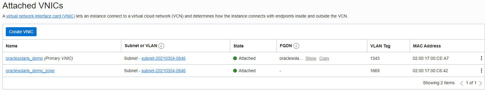

# Creating Oracle Solaris Zones 	


## Introduction

Oracle Solaris Zones is a virtualization technology that enables you to consolidate multiple physical machines and services on a single system. Virtualization reduces costs through the sharing of hardware, infrastructure, and administration. Referring to Dave Miner's blog on using [Oracle Solaris Zones on OCI](https://blogs.oracle.com/solaris/using-solaris-zones-on-oracle-cloud-infrastructure-v2), we need to review a couple of terminology bits.


The original zones introduced in Solaris 10 are known as *non-global zones*, which share a kernel with the global zone but otherwise appear to applications as a separate instance of Solaris. More recently, we introduced *kernel zones* in Solaris 11.2. These run a separate kernel, with specialized network and I/O paths that behave more like a paravirtualized virtual machine. There are also *Solaris 10 branded zones*, which emulate a Solaris 10 environment on a Solaris 11 kernel. All of the *brands* of zones provide a Solaris-native virtualization environment with minimal overhead that can help you get more out of your OCI compute resources. The image at the start of this post from the Solaris 11.4 documentation shows a complex zones environment that might be built anywhere, including in OCI, but this post provides a basic how-to for getting started with non-global and kernel zones in the OCI environment.

In this document we are going to discuss how to install a non-global zone on a virtual machine and briefly on Bare Metal.

Note: *Images in the markdown have been captured on 4th March 2021.*

------

## Setup

After you create and have a VM [instance setup and running](Releasev8_OCI/Launch Instance/OracleSolaris11.4_OCI_Installation.md), a thing to keep in mind is to configure the boot volume size to more than the default 50GB. This helps to accommodate for the additional storage required by Oracle Solaris Zones. After the instance is booted, you'll need to ssh in as the opc user and toggle the root pool's auto-expand property to allow ZFS to see the extra space beyond 50 GB (this is a workaround for an issue with autoexpand on the root pool):

```
# zpool set autoexpand=off rpool;sleep 15;zpool set autoexpand=on rpool
```


After the instance is up and running, you will need to add a second VNIC and attach it to the instance for the zone's network access. After attaching the second VNIC, remember to <u>reboot the instance</u> for the VM to see it.





## Configuring a Non-Global Zone on a Virtual Machine

After your Oracle Solaris instance is running, we use the following steps to configure a non-global zone. Since this approach of using VMs as the global zone is relatively easier with the hypervisor exposing the VNIC to the guest automatically, we don't have to worry about VLAN tags. We can just delegate that physical link as a net resource and configure the allowed address and router. 


#### Configuring the Zone:

------

```
# zonecfg -z demo1
Use 'create' to begin configuring a new zone.
zonecfg:demo1> create
create: Using system default template 'SYSdefault'
zonecfg:demo1> info
zonename: demo1
brand: solaris
anet 0:
        linkname: net0
        configure-allowed-address: true
zonecfg:demo1> remove anet 0
zonecfg:demo1> add net
zonecfg:demo1:net> set physical=net1
zonecfg:demo1:net> set allowed-address=<secondary vnic private ip-address>/23
zonecfg:demo1:net> set defrouter=<primary vnic private ip-address>
zonecfg:demo1:net> end
zonecfg:demo1> info
zonename: demo1
brand: solaris
net 0:
        allowed-address: <secondary vnic private ip-address>/23
        physical: net1
        defrouter: <primary vnic private ip-address>
zonecfg:demo1> commit
zonecfg:demo1> exit
```


Once the zone is configured, we install the zone as usual with `zoneadm -z demo1 install`, then boot it, login via zlogin, and verify the network works.


## Configuring a Non-Global Zone on Bare Metal

Start by setting the default vlan tag on net0 to ensure its traffic is tagged correctly:

```
# dladm set-linkprop -p default-tag=0 net0
```

Now it's time to configure the zone. The key requirement is to configure the anet resource to use the VLAN tag, IP and MAC addresses assigned to the VNIC by OCI, otherwise there won't be any network traffic allowed to or from the zone. Note that you need the prefix length from the VCN configuration. We also set the default router in the zone configuration to ensure it can reach resources outside its local link (by convention the router is the first address on the network).


#### Configuring the Zone:

------

```
# zonecfg -z ngz1
Use 'create' to begin configuring a new zone.
zonecfg:ngz1> create
create: Using system default template 'SYSdefault'
zonecfg:ngz1> info
zonename: ngz1
brand: solaris
anet 0:
	linkname: net0
	configure-allowed-address: true
zonecfg:ngz1> select anet 0
zonecfg:ngz1:anet> set allowed-address=100.106.200.4/23
zonecfg:ngz1:anet> set mac-address=00:00:17:00:BA:64
zonecfg:ngz1:anet> set vlan-id=1
zonecfg:ngz1:anet> set defrouter=100.106.200.1
zonecfg:ngz1:anet> end
zonecfg:ngz1> info
zonename: ngz1
brand: solaris
anet 0:
	linkname: net0
	allowed-address: 100.106.200.4/23
	configure-allowed-address: true
        defrouter: 100.106.200.1
	link-protection: "mac-nospoof, ip-nospoof"
	mac-address: 00:00:17:00:ba:64
	vlan-id: 1
zonecfg:ngz1> commit
zonecfg:ngz1> exit
```


Once the zone is configured, we install the zone as usual with `zoneadm -z ngz1 install`, then boot it, login via zlogin, and verify the network works.

Copyright (c) 2021, Oracle and/or its affiliates. Licensed under the Universal Permissive License v 1.0 as shown at https://oss.oracle.com/licenses/upl/.