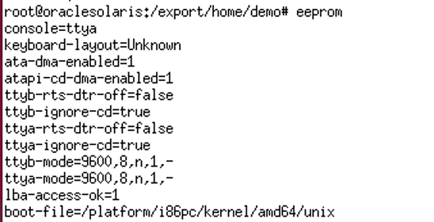
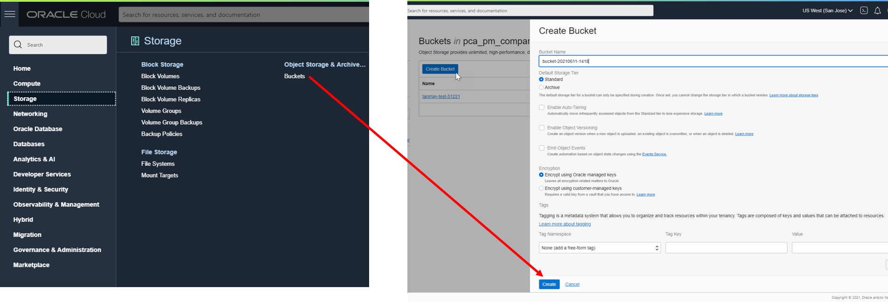
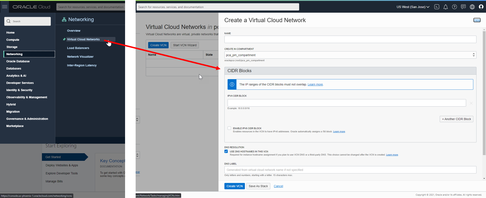
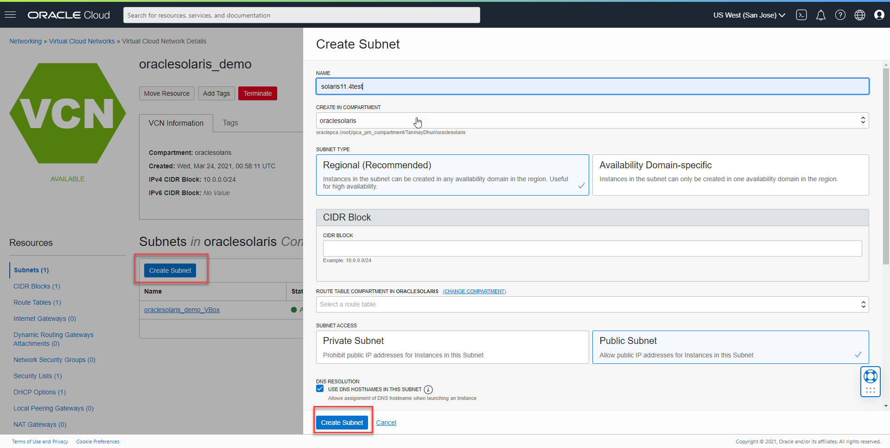
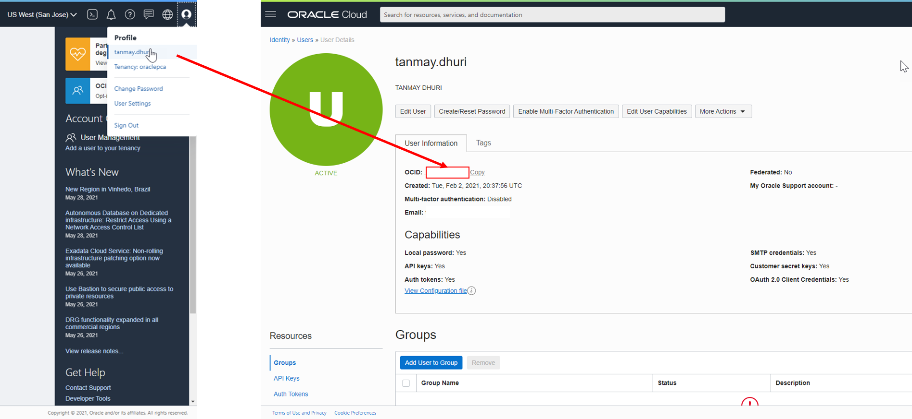
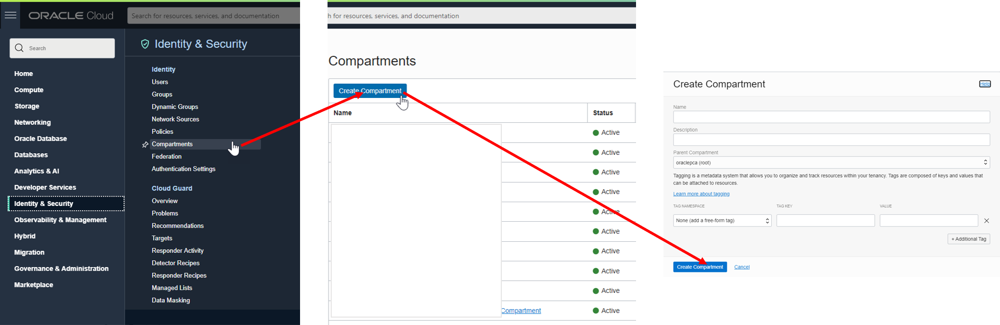
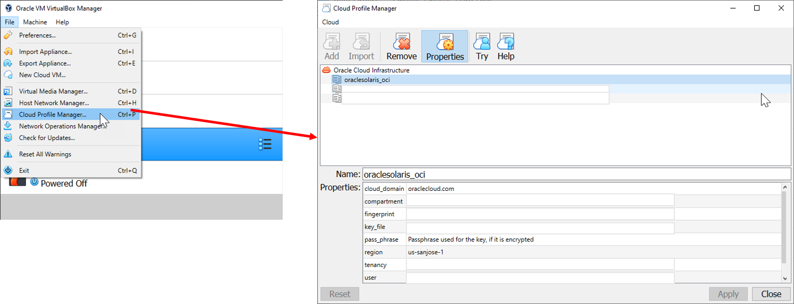
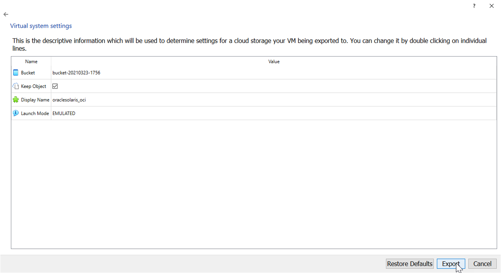
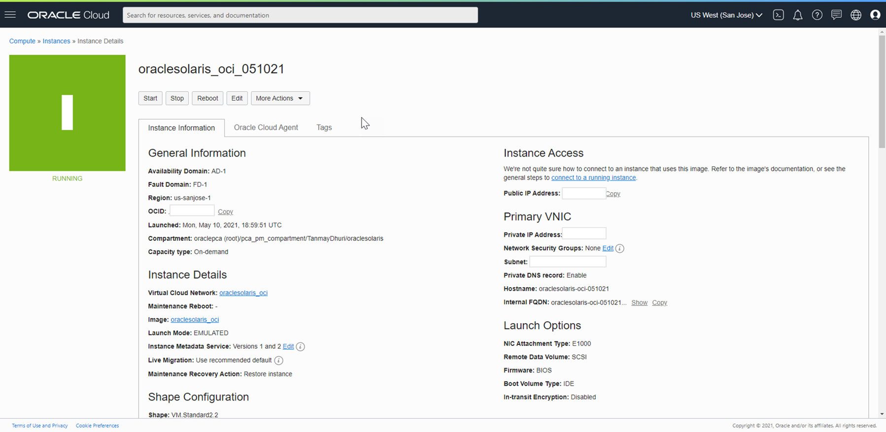

# Migrating Oracle Solaris VM from VirtualBox to OCI

With Oracle Solaris being supported on the Oracle Cloud Infrastructure (OCI), you can now migrate a Oracle Solaris VM running on your local VirtualBox instance to OCI. Oracle VirtualBox 6 has deep integration with Oracle Cloud Infrastructure, enabling Oracle Solaris users to more easily and flexibly migrate their virtual machines to the cloud with a few clicks. Refer to [Simon Coter's whitepaper](https://www.oracle.com/us/technologies/virtualization/oracle-vm-vb-oci-export-20190502-5480003.pdf) to learn more about migrating local virtual machines from VirtualBox to OCI.  

Here are some steps you can follow to export your local Solaris VM instance to a compartment in OCI:

## Step 1: Oracle Solaris on VirtualBox

The Oracle Solaris image has been traditionally available on Oracle VirtualBox , with the ability to spin up VM's on your local machines. However, the drawback running VM's on your desktop or laptop is the increased consumption of your local compute resources. Since Oracle Solaris 11.4 is supported in the cloud, you can now easily migrate your Solaris VM's to OCI and tap into the vast compute and storage resources OCI has to offer. You can refer to our [GitHub directory](https://github.com/oracle/oraclesolaris-contrib/tree/master/OracleSolaris_OCI)  or [Dave Miner's blog](https://blogs.oracle.com/author/dave-miner) to learn more about using Oracle Solaris on OCI. 

### 1.1 Updating your Oracle Solaris VM

Before we start migration to OCI, we need to ensure the VM has been updated to the latest SRU update of Oracle Solaris 11.4. Even though earlier images of Oracle Solaris 11.4 are supported on OCI, getting the most recent version for Oracle Solaris ensures better support for OCI shapes and drivers. You can use the`pkg update` command to ensure you have the latest SRU installed for you Oracle Solaris VM on VBox.

### 1.2 Set EEPROM parameter for Console

In case you need to access the Oracle Solaris console through OCI Cloud Shell, you will need to change* eeprom parameters for the console.  To check whether you have the correct attribute set run the `eeprom` command. Ensure `console=ttya` is set appropriately. Once you have checked this attribute you can shut down your VM. 

*Note: You need to have root user privileges' to change/set eeprom parameters.

### 1.3 Set networking to DHCP

The OCI Networking service uses DHCP to automatically provide configuration information to instances when they boot up. Although DHCP lets you change some settings dynamically, others are static and never change. For example, when you launch an instance, either you or Oracle specifies the instance's private IP address. Each time the instance boots up or you restart the instance's DHCP client, DHCP passes that same private IP address to the instance. The address never changes during the instance's lifetime.

You can follow the steps on the [Oracle Solaris man page](https://docs.oracle.com/cd/E53394_01/html/E54838/gnwqz.html#OSTELgoagu)  to check and change the DHCP configuration for your VM's, alternatively if you're very familiar with OCI you could set the network configuration over the console connection once the VM has started.

Once you have checked this attribute you can shut down your VM. 

### 1.4 Download the Oracle VirtualBox extension pack

The Oracle VirtualBox extension pack enables cloud integration features which in turn help a user import/export virtual machines from the Oracle Cloud Infrastructure. If you don't already have the extension pack, you can download it [here](https://www.virtualbox.org/wiki/Downloads).

------

## Step 2: Preparing your Oracle Cloud Infrastructure Instance

After you have completed Step 1, you need to login to your OCI Instance and ensure that your tenancy has been prepared to host the VM from your VirtualBox. Here are the steps that you need to follow while preparing your OCI Instance:

### 2.1 Creating a bucket in your compartment

A Bucket, part of the Oracle Cloud Infrastructure Object Storage service, is a container for storing objects in a compartment within an Object Storage namespace. A Bucket is associated with a single compartment. A Bucket is used by Oracle VM VirtualBox to upload and save the Virtual Machine Image on Oracle Cloud Infrastructure.

- On the OCI Main Menu, click on "Storage==> Buckets"
- Click "Create Bucket"
- Choose your preferred name and confirm creation of the bucket

### 2.2 Creating a Virtual Cloud Network (VCN)

The OCI VCN is a virtual, private network that can be set up in OCI. It closely resembles a traditional network, with firewall rules and specific types of communication gateways. If you don't already have one set up create an OCI Virtual Cloud Network (VCN). VirtualBox will automatically use the VCN associated with the compartment you configure.

- On the OCI Main Menu, click on "Networking==> Virtual Cloud Network"
- Click "Create VCN"
- Choose your preferred name and confirm creation of the VCN

------

### 2.2 Creating a Subnet within your Virtual Cloud Network (VCN)*

*if you already have a subnet defined within your VCN, you can continue using it to migrate from VirtualBox to OCI else you can follow the steps below.

- Once your new VCN has been provisioned, click on "Create Subnet"
- Choose your preferred name for the subnet
- [Define a CIDR block](https://docs.oracle.com/en-us/iaas/Content/Network/Tasks/managingVCNs_topic-Overview_of_VCNs_and_Subnets.htm#Overview) 
- Click "Create Subnet"

------

## Step 3: Retrieving critical information from OCI

Before you are able to start exporting VM's from VirtualBox, you need to configure the Cloud Profile Manager to interact with your OCI resources. Here is the information Oracle VirtualBox needs to authenticate and interface with OCI.

Requirements:
The first step is to collect a list of information, possibly in a text file, from the OCI Console:

- User OCID
- Tenancy OCID
- Region Name
- Compartment OCID
- Key_file and Fingerprint

If you already have the OCI CLI tools installed on your system you may already have these in `~/.oci/config`

### 3.1 User

To find your OCI User ID (OCID), navigate to your profile on the OCI homepage and click on your profile name. You can then copy your corresponding User OCID.

### 3.2 Tenancy

A tenancy is a secure and isolated partition within Oracle Cloud Infrastructure used to create, organize, and administer cloud resources. Each tenancy has its own OCID. 

To collect this information, click on the “OCI Main Menu” =>“Governance & Administration” => “Tenancy Details”

In the “Tenancy Information” window, click on “Copy” to copy your Tenancy OCID to the clipboard.

### 3.3 Compartment

A compartment is a collection of related resources (such as cloud networks, compute instances, or block volumes) that can be accessed only by those groups that have been given permission by an administrator in your organization. Each compartment has its own OCID.

 To collect this information click on the “OCI Main Menu” => “Identity” =>“Compartments”.

In the “Compartments” window, click on the Compartment OCID and then on the “Copy” button to copy your Compartment OCID to the clipboard.

### 3.4 Key File and Fingerprint 

The “Key File” and “Fingerprint” have to be generated on your own system. To accomplish this, follow the instructions in the [OCI Documentation – Required Keys and OCID](https://docs.cloud.oracle.com/iaas/Content/API/Concepts/apisigningkey.htm), starting at the section “How to Generate an API Signing Key”.

------

## Step 4: Configuring Cloud Profile Manager on Oracle VirtualBox

Once you have all the required information as mentioned in Step 3, you can launch your local VirtualBox instance to configure the Cloud Profile.

- Launch VirtualBox GUI and navigate to " File => Cloud Profile Manager"
- Click on the Add button and name your Cloud Profile
- In the Properties tab, add all the values captured in Step 3
- Click Apply

------

## Step 5: Exporting your VM to Oracle Cloud Infrastructure

Once you are done with all the steps, you can then navigate to your VM in VirtualBox to export it to OCI.

- Right click on the Oracle Solaris VM and ensure its powered off
- Next click on the "Export to OCI" button
- Under Format choose Oracle Cloud Infrastructure and select your Account(created in Step 4)
- Click Continue
- Next define the OCI Instance configurations as per your requirements
- Click Export

Once all the above steps are successfully complete, your instance will be available on OCI.

Note: Images in this markdown have been captured on 06/11/2021.

Copyright (c) 2021, Oracle and/or its affiliates.
Licensed under the Universal Permissive License v 1.0 as shown at [https://oss.oracle.com/licenses/upl/](https://oss.oracle.com/licenses/upl/).