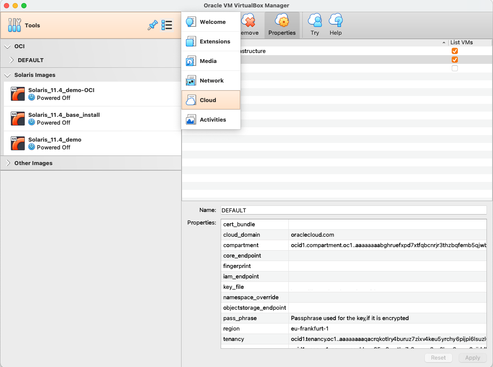
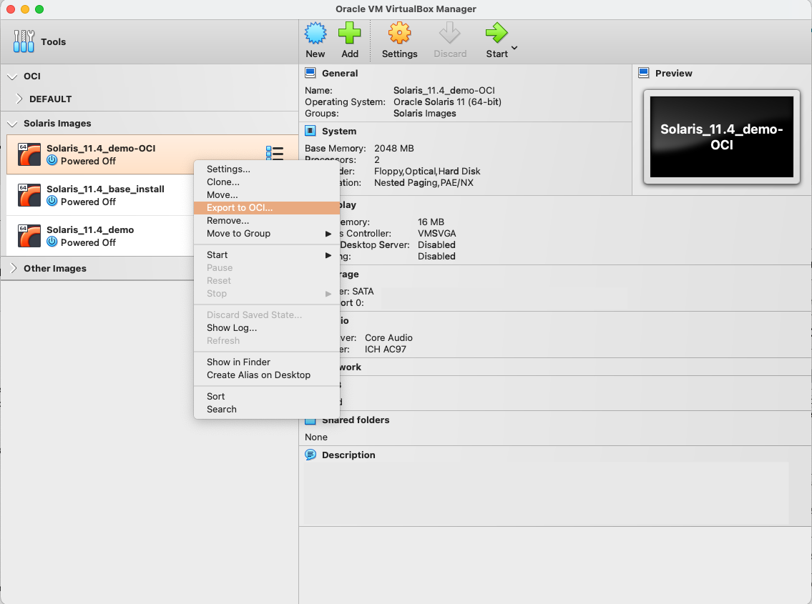
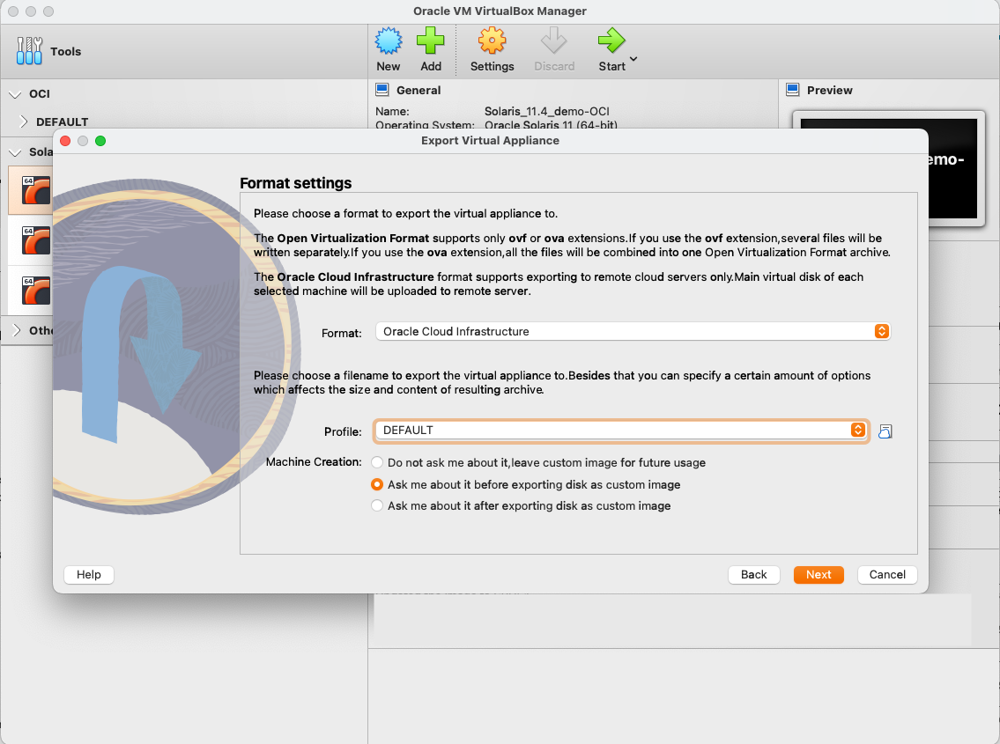
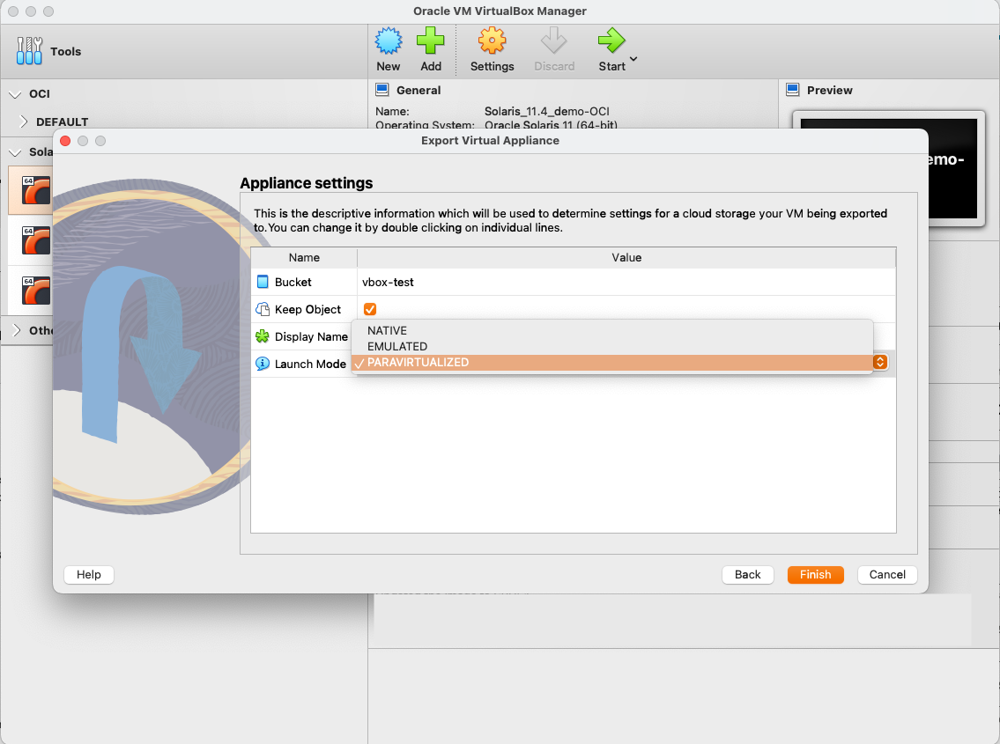
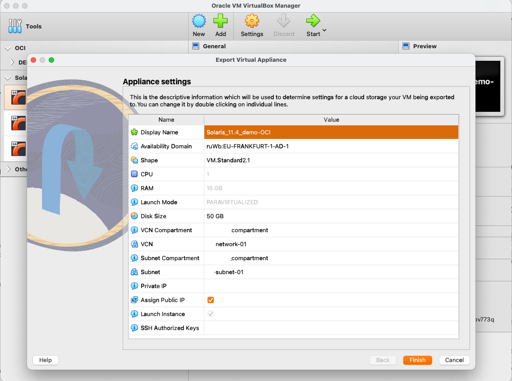
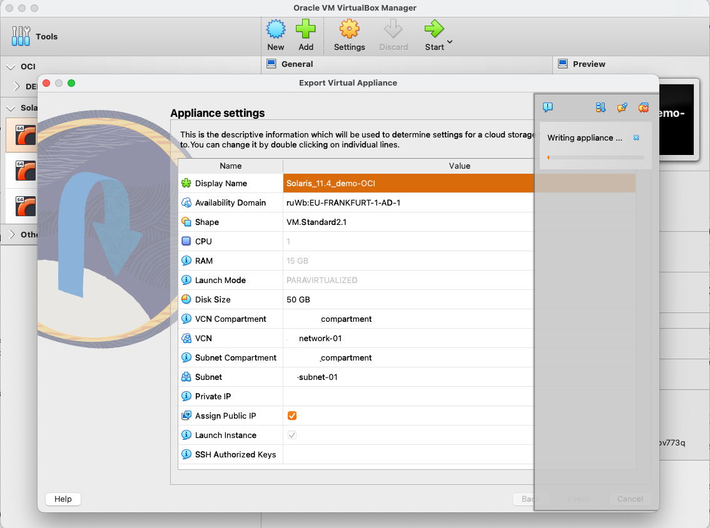
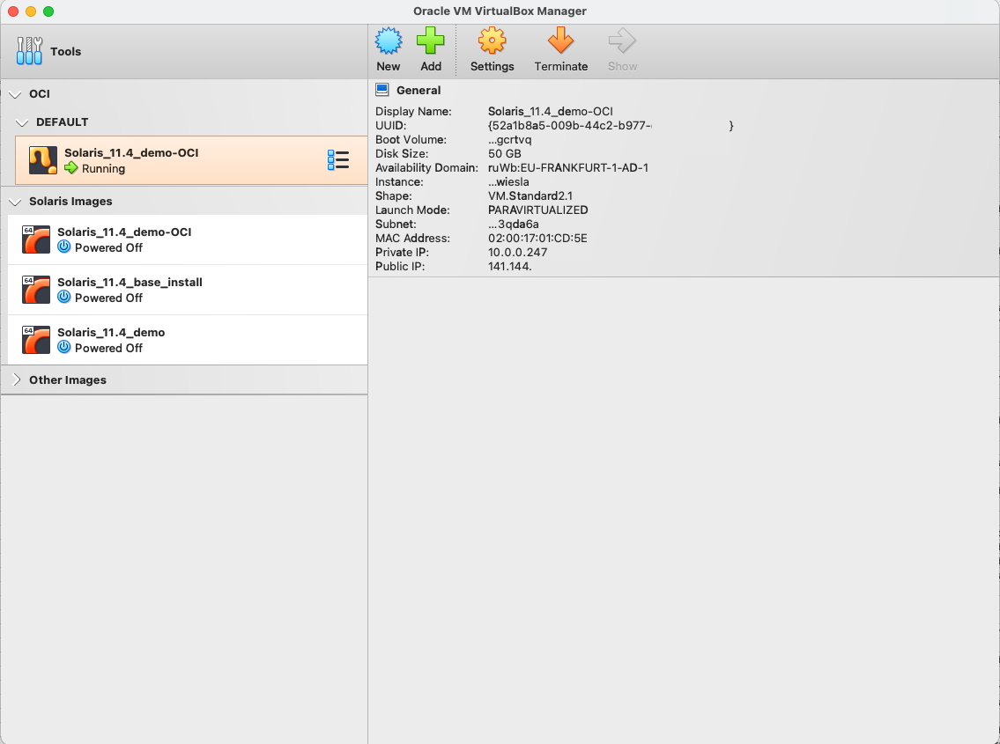

# Migrating Oracle Solaris VM from VirtualBox to OCI

> This document was originally written for VirtualBox 6 and Oracle Solaris 11.4 SRU32, it has since been updated to also cover VirtualBox 7 and Oracle Solaris 11.4 SRU50.

With Oracle Solaris being supported on the Oracle Cloud Infrastructure (OCI), you can now migrate a Oracle Solaris VM running on your local VirtualBox instance to OCI. Oracle VirtualBox 6 and 7 have deep integration with Oracle Cloud Infrastructure, enabling Oracle Solaris users to more easily and flexibly migrate their virtual machines to the cloud with a few clicks. Refer to [Simon Coter's whitepaper](https://www.oracle.com/us/technologies/virtualization/oracle-vm-vb-oci-export-20190502-5480003.pdf) to learn more about migrating local virtual machines from VirtualBox to OCI.

Here are some steps you can follow to export your local Solaris VM instance to a compartment in OCI:

## Step 1 — Oracle Solaris on VirtualBox

The Oracle Solaris image has been traditionally available on Oracle VirtualBox , with the ability to spin up VM's on your local machines. However, the drawback running VM's on your desktop or laptop is the increased consumption of your local compute resources. Since Oracle Solaris 11.4 is supported in the cloud, you can now easily migrate your Solaris VM's to OCI and tap into the vast compute and storage resources OCI has to offer. You can refer to our [GitHub directory](https://github.com/oracle/oraclesolaris-contrib/tree/master/OracleSolaris_OCI), our [Oracle Solaris Blog](https://blogs.oracle.com/solaris/post/migrating-oracle-solaris-to-oci-using-virtualbox-7) or [Dave Miner's blog](https://blogs.oracle.com/author/dave-miner) to learn more about using Oracle Solaris on OCI. 

### 1.1 Updating your Oracle Solaris VM

Before we start migration to OCI, we need to ensure the VM has been updated to the latest SRU update of Oracle Solaris 11.4. Even though earlier images of Oracle Solaris 11.4 are supported on OCI, getting the most recent version for Oracle Solaris ensures better support for OCI shapes and drivers. You can use the`pkg update` command to ensure you have the latest SRU installed for you Oracle Solaris VM on VirtualBox. 

Note Oracle Solaris 11.4 SRU33 and higher now has `virtio` drivers that allows Oracle Solaris to run in Paravirtualized mode on the OCI VM shapes at optimal performance.

### 1.2 Set EEPROM parameter for Console

In case you need to access the Oracle Solaris console through OCI Cloud Shell, you will need to change* eeprom parameters for the console.  To check whether you have the correct attribute set run the `eeprom` command. Ensure `console=ttya` is set appropriately. Once you have checked this attribute you can shut down your VM. 

*Note: You need to have root user privileges' to change/set eeprom parameters.

```bash
# eeprom
keyboard-layout=Unknown
ata-dma-enabled=1
atapi-cd-dma-enabled=1
ttyb-rts-dtr-off=false
ttyb-ignore-cd=true
ttya-rts-dtr-off=false
ttya-ignore-cd=true
ttyb-mode=9600,8,n,1,-
ttya-mode=9600,8,n,1,-
lba-access-ok=1
console=ttya
```

### 1.3 Set networking to DHCP

The OCI Networking service uses DHCP to automatically provide configuration information to instances when they boot up. Although DHCP lets you change some settings dynamically, others are static and never change. For example, when you launch an instance, either you or Oracle specifies the instance's private IP address. Each time the instance boots up or you restart the instance's DHCP client, DHCP passes that same private IP address to the instance. The address never changes during the instance's lifetime.

By default Oracle Solaris will use DHCP when installed and configured, however you can follow the steps on the [Oracle Solaris man page](https://docs.oracle.com/cd/E37838_01/html/E60988/goasn.html)  to check and change the DHCP configuration for your VM's, alternatively if you're familiar with OCI you could set the network configuration over the console connection once the VM has started.

### 1.4 Upload SSH key

Optionally you can upload an SSH key to the `~/.ssh/knownhosts` file in a user account's home directory. This will allow you to use SSH to log on over the network to your Oracle Solaris instance once it is up and running in a password-less manner.

Once you have done these things you can shut down your VM. 

### 1.5 Download the Oracle VirtualBox extension pack

The Oracle VirtualBox extension pack enables cloud integration features which in turn help a user import/export virtual machines from the Oracle Cloud Infrastructure. If you don't already have the extension pack, you can download it [here](https://www.virtualbox.org/wiki/Downloads).

------

## Step 2 — Preparing your Oracle Cloud Infrastructure Instance

After you have completed Step 1, you need to login to your OCI Instance and ensure that your tenancy has been prepared to host the VM from your VirtualBox. Here are the steps that you need to follow while preparing your OCI Instance.

### 2.1 Creating a bucket in your compartment

A Bucket, part of the Oracle Cloud Infrastructure Object Storage service, is a container for storing objects in a compartment within an Object Storage namespace. A Bucket is associated with a single compartment. A Bucket is used by Oracle VM VirtualBox to upload and save the Virtual Machine Image on Oracle Cloud Infrastructure. If you don't already have a Bucket set up for this migration follow these steps:

- On the OCI Main Menu, click on **Storage** => **Buckets**
- Click **Create Bucket**
- Choose your preferred name and confirm creation of the bucket


### 2.2 Creating a Virtual Cloud Network (VCN)

The OCI VCN is a virtual, private network that can be set up in OCI. It closely resembles a traditional network, with firewall rules and specific types of communication gateways. If you don't already have one set up create an OCI Virtual Cloud Network (VCN). VirtualBox will automatically use the VCN associated with the compartment you configure.

- On the OCI Main Menu, click on **Networking** => **Virtual Cloud Network**
- Click **Create VCN**
- Choose your preferred name and confirm creation of the VCN

------


### 2.2 Creating a Subnet within your Virtual Cloud Network (VCN)

If you already have a Subnet defined within your VCN, you can continue using it to migrate from VirtualBox to OCI, else you can follow the steps below.

- Once your new VCN has been provisioned, click on **Create Subnet**
- Choose your preferred name for the Subnet
- [Define a CIDR block](https://docs.oracle.com/en-us/iaas/Content/Network/Tasks/managingVCNs_topic-Overview_of_VCNs_and_Subnets.htm#Overview) 
- Click **Create Subnet**


------

## Step 3: Retrieving critical information from OCI

Before you are able to start exporting VM's from VirtualBox, you need to configure the Cloud Profile Manager in VirtualBox to interact with your OCI resources. If you already have the OCI CLI tools installed on your system you may already have these in `~/.oci/config` and VirtualBox will probably pick them up.

The following information is needed by VirtualBox to authenticate and interface with OCI. If needed, the first step is to collect a list of information from the OCI Console:

- User OCID
- Tenancy OCID
- Region Name
- Compartment OCID
- Key_file and Fingerprint

With the release of VirtualBox 7 Simon Coter released a [blog and video](blogs.oracle.com/scoter/post/configure-virtualbox-7-to-work-with-oracle-cloud-infrastructure) on how to set this up too.

### 3.1 User

To find your OCI User ID (OCID), navigate to your profile on the OCI homepage and click on your profile name. You can then copy your corresponding User OCID.


### 3.2 Tenancy

A tenancy is a secure and isolated partition within Oracle Cloud Infrastructure used to create, organize, and administer cloud resources. Each tenancy has its own OCID. 

To collect this information, click on the **OCI Main Menu** => **Governance & Administration** => **Tenancy Details**

In the **Tenancy Information** window, click on **Copy** to copy your Tenancy OCID to the clipboard.


### 3.3 Compartment

A compartment is a collection of related resources (such as cloud networks, compute instances, or block volumes) that can be accessed only by those groups that have been given permission by an administrator in your organization. Each compartment has its own OCID.

 To collect this information click on the **OCI Main Menu** => **Identity** => **Compartments**.

In the **Compartments** window, click on the Compartment OCID and then on the **Copy** button to copy your Compartment OCID to the clipboard.


### 3.4 Key File and Fingerprint 

The **Key File** and **Fingerprint** have to be generated on your own system. To accomplish this, follow the instructions in the [OCI Documentation – Required Keys and OCID](https://docs.cloud.oracle.com/iaas/Content/API/Concepts/apisigningkey.htm), starting at the section “How to Generate an API Signing Key”.

------

## Step 4: Configuring Cloud Profile Manager on Oracle VirtualBox

Once you have all the required information as mentioned in Step 3, you can launch your local VirtualBox instance to configure the Cloud Profile. The way to navigate to it is different in VirtualBox 6 vs. VirtualBox 7. In VirtualBox 6 do the following steps:

- Launch VirtualBox GUI and navigate to **File** => **Cloud Profile Manager**
- Click on the Add button and name your Cloud Profile
- In the **Properties** tab, add all the values captured in Step 3
- Click **Apply**


In VirtualBox 7 the link to the Cloud Profile Manager and the Cloud Profile Manager itself is integrated into the main window. In the main window go to the **Tools** box on the left and click on the options icon. This will bring up an options list and when you select the **Cloud** option, the right hand pane will show the Cloud Profile Manager:



------

## Step 5: Exporting your VM to Oracle Cloud Infrastructure

Once you are done with all the steps, you can then navigate to your VM in VirtualBox to export it to OCI. To do this right click the name of the VM want to migrate and select **Export to OCI...**

This will bring up a new window:



You make sure the **Format:** is **Oracle Cloud Infrastructure** and select the OCI profile you would like to use. Then under **Machine Creation:** you can choose the point at which you will configure the destination VM. Choose the middle option, **Ask me about it before exporting the disk as a custom image**, as it will allow you to do the configuration before the image gets prepared and uploaded to OCI, so you don't have to wait for this. Then click on **Next**.



VirtualBox will now connect to OCI and allow you to choose which **Bucket** to use, the name of the instance (called **Display Name**), and the **Launch Mode**. For the **Launch Mode** change it from the default **EMULATED** to **PARAVIRTUALIZED** because we want the performance to be optimal. Then click on **Finish**.



VirtualBox will now connect to OCI to load the options you have and display them on a new screen:



Here you will want to change or choose the following things:

- The **Display Name** in case you want to change it
- The **Availability Domain**
- The **Shape** and possibly the **CPU** and **RAM** sizes if you choose a Flex Shape
- The **Disk Size**
- The **VCN Compartment**, **VCN**, **Subnet Compartment**, and **Subnet**
- If you want a **Public IP** address or not

Once you're ready click on **Finish**, and VirtualBox will go off and create the instance. For larger images this may take quite a while.



Once it is done the instance should show up in the **OCI** group in the BUI with its information next to it:



You can also find your instance through the OCI Console


That's it.

> Note: Images in this markdown have been captured on 06/11/2021 and 12/19/2022.

Copyright (c) 2022, Oracle and/or its affiliates.
Licensed under the Universal Permissive License v 1.0 as shown at [https://oss.oracle.com/licenses/upl/](https://oss.oracle.com/licenses/upl/).