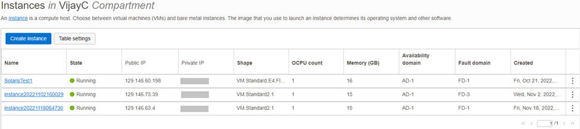

As you all might have already learned by our previous blogpost Oracle Solaris Shines through the Cloud, we are in a process to create and publish a series of blogs and Github posts on “How to create an Oracle Solaris Instance in OCI.” In this blog, I’ll show you a step-by-step procedure on how to create an Oracle Solaris Instance using the OCI CLI. Alternatively, if you prefer to launch an Oracle Solaris Instance using Oracle Cloud Console, please refer to this blog - Using the Oracle Cloud Console to Provision Oracle Solaris

The Oracle Cloud Infrastructure CLI is a lightweight tool that you may use by itself or in conjunction with the Console to carry out activities. Along with extra commands, the CLI offers the same fundamental features as the Console. The functionality of the Console is extended by some of these, such as the capability to execute scripts.

We want to briefly go through the prerequisites before creating the Instance. We assume that you have already completed the following tasks/steps:

Have an Oracle OCI Account
Create a compartment
Create a VCN, Subnet, Internet Gateway, and route table. If not, please refer to this documentation
OCI-CLI is fully configured and ready to use. If not, please refer to this documentation.
Note: These are the commands needed as of Nov 2022.

1) List the shapes that can be used to launch an instance within the specified compartment and select a shape based on your preference. In this article, we are using the “VM.Standard2.1” shape.

```
$ oci compute shape list --compartment-id ocid1.compartment.oc1..xxxxxxxxxxxxxxxxxxxxxxxxx 
{
  "data": [
    {
      "baseline-ocpu-utilizations": null,
      "billing-type": "PAID",
      "gpu-description": null,
      "gpus": 0,
      "is-billed-for-stopped-instance": false,
      "is-flexible": false,
      "is-live-migration-supported": false,
      "is-subcore": false,
      "local-disk-description": null,
      "local-disks": 0,
      "local-disks-total-size-in-gbs": null,
      "max-vnic-attachment-options": null,
      "max-vnic-attachments": 256,
      "memory-in-gbs": 1024.0,
      "memory-options": null,
      "min-total-baseline-ocpus-required": null,
      "network-ports": 2,
      "networking-bandwidth-in-gbps": 100.0,
      "networking-bandwidth-options": null,
      "ocpu-options": null,
      "ocpus": 160.0,
      "platform-config-options": null,
      "processor-description": "3.0 GHz Ampere\u00ae Altra\u2122",
      "quota-names": [
        "standard-a1-memory-count",
        "standard-a1-memory-regional-count",
        "standard-a1-core-count",
        "standard-a1-core-regional-count"
      ],
      "rdma-bandwidth-in-gbps": 0,
      "rdma-ports": 0,
      "recommended-alternatives": null,
      "resize-compatible-shapes": null,
      "shape": "BM.Standard.A1.160"
    },
$ oci compute shape list --compartment-id ocid1.compartment.oc1..xxxxxxxxxxxxxxxxxxxxxxxxx 
{
  "data": [
    {
      "baseline-ocpu-utilizations": null,
      "billing-type": "PAID",
      "gpu-description": null,
      "gpus": 0,
      "is-billed-for-stopped-instance": false,
      "is-flexible": false,
      "is-live-migration-supported": false,
      "is-subcore": false,
      "local-disk-description": null,
      "local-disks": 0,
      "local-disks-total-size-in-gbs": null,
      "max-vnic-attachment-options": null,
      "max-vnic-attachments": 256,
      "memory-in-gbs": 1024.0,
      "memory-options": null,
      "min-total-baseline-ocpus-required": null,
      "network-ports": 2,
      "networking-bandwidth-in-gbps": 100.0,
      "networking-bandwidth-options": null,
      "ocpu-options": null,
      "ocpus": 160.0,
      "platform-config-options": null,
      "processor-description": "3.0 GHz Ampere\u00ae Altra\u2122",
      "quota-names": [
        "standard-a1-memory-count",
        "standard-a1-memory-regional-count",
        "standard-a1-core-count",
        "standard-a1-core-regional-count"
      ],
      "rdma-bandwidth-in-gbps": 0,
      "rdma-ports": 0,
      "recommended-alternatives": null,
      "resize-compatible-shapes": null,
      "shape": "BM.Standard.A1.160"
    },
```

2) Get the `--listing-id` of the latest Oracle Solaris 11.4 image by executing the following command.

```
$ oci marketplace listing list --name "Oracle Solaris"
{
  "data": [
    {
      "categories": [
        "Operating Systems"
      ],
      "compatible-architectures": [
        "X86"
      ],
      "icon": {
        "content-url": "<a href="https://objectstorage.us-phoenix-1.oraclecloud.com/p/1P2G0hM9Ew4ZV3C0vX8PmDfviyuE2HIDrmsxcX56-eRSEh7hBYRKTn8BYzYiOAJ6/n/marketplaceprod/b/pacman-prod-consumer-content/o/136471195.png" rel="nofollow">https://objectstorage.us-phoenix-1.oraclecloud.com/p/1P2G0hM9Ew4ZV3C0vX8PmDfviyuE2HIDrmsxcX56-eRSEh7hBYRKTn8BYzYiOAJ6/n/marketplaceprod/b/pacman-prod-consumer-content/o/136471195.png</a>",
        "file-extension": "png",
        "mime-type": "image/png",
        "name": ""
      },
      "id": "61750333",
      "is-featured": false,
      "is-rover-exportable": false,
      "listing-type": "PARTNER",
      "name": "Oracle Solaris 11.4",
      "package-type": "IMAGE",
      "pricing-types": [
        "FREE"
      ],
      "publisher": {
        "description": "With more than 380,000 customers\u2014including 100 of the Fortune 100\u2014and with deployments across a wide variety of industries in more than 145 countries around the globe, Oracle offers an optimized and fully integrated stack of business hardware and software systems. Oracle engineers hardware and software to work together in the cloud and in your data center\u2013from servers and storage, to database and middleware, through applications. Learn more about Oracle <a href="http://oracle.com/us/corporate" rel="nofollow">http://oracle.com/us/corporate</a>",
        "id": "5190498",
        "name": "Oracle"
      },
      "regions": null,
      "short-description": "The Oracle Solaris 11.4 operating system base image configured for use on Oracle Cloud Infrastructure.   Support for both virtual machines and bare metal is provided.",
      "supported-operating-systems": null,
      "tagline": "The Oracle Solaris 11.4 operating system"
    }
  ]
}
$ oci marketplace listing list --name "Oracle Solaris"
{
  "data": [
    {
      "categories": [
        "Operating Systems"
      ],
      "compatible-architectures": [
        "X86"
      ],
      "icon": {
        "content-url": "<a href="https://objectstorage.us-phoenix-1.oraclecloud.com/p/1P2G0hM9Ew4ZV3C0vX8PmDfviyuE2HIDrmsxcX56-eRSEh7hBYRKTn8BYzYiOAJ6/n/marketplaceprod/b/pacman-prod-consumer-content/o/136471195.png" rel="nofollow">https://objectstorage.us-phoenix-1.oraclecloud.com/p/1P2G0hM9Ew4ZV3C0vX8PmDfviyuE2HIDrmsxcX56-eRSEh7hBYRKTn8BYzYiOAJ6/n/marketplaceprod/b/pacman-prod-consumer-content/o/136471195.png</a>",
        "file-extension": "png",
        "mime-type": "image/png",
        "name": ""
      },
      "id": "61750333",
      "is-featured": false,
      "is-rover-exportable": false,
      "listing-type": "PARTNER",
      "name": "Oracle Solaris 11.4",
      "package-type": "IMAGE",
      "pricing-types": [
        "FREE"
      ],
      "publisher": {
        "description": "With more than 380,000 customers\u2014including 100 of the Fortune 100\u2014and with deployments across a wide variety of industries in more than 145 countries around the globe, Oracle offers an optimized and fully integrated stack of business hardware and software systems. Oracle engineers hardware and software to work together in the cloud and in your data center\u2013from servers and storage, to database and middleware, through applications. Learn more about Oracle <a href="http://oracle.com/us/corporate" rel="nofollow">http://oracle.com/us/corporate</a>",
        "id": "5190498",
        "name": "Oracle"
      },
      "regions": null,
      "short-description": "The Oracle Solaris 11.4 operating system base image configured for use on Oracle Cloud Infrastructure.   Support for both virtual machines and bare metal is provided.",
      "supported-operating-systems": null,
      "tagline": "The Oracle Solaris 11.4 operating system"
    }
  ]
}
```

3) In the previous command, the `--lisitng-id` is displayed as `"id": "61750333"`, we use this `"id"` to obtain the `"package-version"` of the image. I sorted the results by `TIMERELEASED` in the `DESC` order to get the latest package version.

```
$ oci marketplace package list --listing-id "61750333" --sort-by TIMERELEASED --sort-order DESC
{
  "data": [
    {
      "listing-id": "61750333",
      "package-type": "IMAGE",
      "package-version": "11.4.50",
      "pricing": null,
      "regions": null,
      "resource-id": "136289820",
      "time-created": "2022-10-18T00:00:00+00:00"
    },
    {
      "listing-id": "61750333",
      "package-type": "IMAGE",
      "package-version": "11.4.47",
      "pricing": null,
      "regions": null,
      "resource-id": "130703152",
      "time-created": "2022-07-19T00:00:00+00:00"
    },
    {
      "listing-id": "61750333",
      "package-type": "IMAGE",
      "package-version": "11.4.44",
      "pricing": null,
      "regions": null,
      "resource-id": "124760143",
      "time-created": "2022-04-19T00:00:00+00:00"
    },
    {
      "listing-id": "61750333",
      "package-type": "IMAGE",
      "package-version": "11.4.41",
      "pricing": null,
      "regions": null,
      "resource-id": "117905656",
      "time-created": "2022-01-20T00:00:00+00:00"
    },
    {
      "listing-id": "61750333",
      "package-type": "IMAGE",
      "package-version": "11.4.38",
      "pricing": null,
      "regions": null,
      "resource-id": "111932951",
      "time-created": "2021-10-19T00:00:00+00:00"
    },
    {
      "listing-id": "61750333",
      "package-type": "IMAGE",
      "package-version": "11.4 Virtual Machine",
      "pricing": null,
      "regions": null,
      "resource-id": "65348381",
      "time-created": "2019-10-28T00:00:00+00:00"
    },
    {
      "listing-id": "61750333",
      "package-type": "IMAGE",
      "package-version": "11.4 Bare Metal",
      "pricing": null,
      "regions": null,
      "resource-id": "65347213",
      "time-created": "2019-10-28T00:00:00+00:00"
    }
  ]
}
$ oci marketplace package list --listing-id "61750333" --sort-by TIMERELEASED --sort-order DESC
{
  "data": [
    {
      "listing-id": "61750333",
      "package-type": "IMAGE",
      "package-version": "11.4.50",
      "pricing": null,
      "regions": null,
      "resource-id": "136289820",
      "time-created": "2022-10-18T00:00:00+00:00"
    },
    {
      "listing-id": "61750333",
      "package-type": "IMAGE",
      "package-version": "11.4.47",
      "pricing": null,
      "regions": null,
      "resource-id": "130703152",
      "time-created": "2022-07-19T00:00:00+00:00"
    },
    {
      "listing-id": "61750333",
      "package-type": "IMAGE",
      "package-version": "11.4.44",
      "pricing": null,
      "regions": null,
      "resource-id": "124760143",
      "time-created": "2022-04-19T00:00:00+00:00"
    },
    {
      "listing-id": "61750333",
      "package-type": "IMAGE",
      "package-version": "11.4.41",
      "pricing": null,
      "regions": null,
      "resource-id": "117905656",
      "time-created": "2022-01-20T00:00:00+00:00"
    },
    {
      "listing-id": "61750333",
      "package-type": "IMAGE",
      "package-version": "11.4.38",
      "pricing": null,
      "regions": null,
      "resource-id": "111932951",
      "time-created": "2021-10-19T00:00:00+00:00"
    },
    {
      "listing-id": "61750333",
      "package-type": "IMAGE",
      "package-version": "11.4 Virtual Machine",
      "pricing": null,
      "regions": null,
      "resource-id": "65348381",
      "time-created": "2019-10-28T00:00:00+00:00"
    },
    {
      "listing-id": "61750333",
      "package-type": "IMAGE",
      "package-version": "11.4 Bare Metal",
      "pricing": null,
      "regions": null,
      "resource-id": "65347213",
      "time-created": "2019-10-28T00:00:00+00:00"
    }
  ]
}
```

4) Now, use the `listing-id` and the `package-version` to get the `--image-id`.

```
$ oci marketplace package get --listing-id "61750333" --package-version "11.4.50"
{
  "data": {
    "app-catalog-listing-id": "ocid1.appcataloglisting.oc1..aaaaaaaa72lfxnjprgn2ei3wlvwrdxxxluolxksbdjl3goyv6zrggsefhfva",
    "app-catalog-listing-resource-version": "11.4.50",
    "description": "",
    "image-id": "ocid1.image.oc1..aaaaaaaaa5tsn4iyzknn4mugs36cwuofwqspvwrr6vct75r4lpplqmtitdvq",
    "listing-id": "61750333",
    "operating-system": null,
    "package-type": "IMAGE",
    "pricing": {
      "currency": null,
      "international-market-price": null,
      "pay-go-strategy": null,
      "rate": null,
      "type": "FREE"
    },
    "regions": [],
    "resource-id": "136289820",
    "time-created": "2022-10-18T00:00:00+00:00",
    "version": "11.4.50"
  },
  "etag": "6af825bd62cf470bdb2626e42979ea310496af7c66f51ef447bade39fbcc93dd--gzip"
}
$ oci marketplace package get --listing-id "61750333" --package-version "11.4.50"
{
  "data": {
    "app-catalog-listing-id": "ocid1.appcataloglisting.oc1..aaaaaaaa72lfxnjprgn2ei3wlvwrdxxxluolxksbdjl3goyv6zrggsefhfva",
    "app-catalog-listing-resource-version": "11.4.50",
    "description": "",
    "image-id": "ocid1.image.oc1..aaaaaaaaa5tsn4iyzknn4mugs36cwuofwqspvwrr6vct75r4lpplqmtitdvq",
    "listing-id": "61750333",
    "operating-system": null,
    "package-type": "IMAGE",
    "pricing": {
      "currency": null,
      "international-market-price": null,
      "pay-go-strategy": null,
      "rate": null,
      "type": "FREE"
    },
    "regions": [],
    "resource-id": "136289820",
    "time-created": "2022-10-18T00:00:00+00:00",
    "version": "11.4.50"
  },
  "etag": "6af825bd62cf470bdb2626e42979ea310496af7c66f51ef447bade39fbcc93dd--gzip"
}
```

Terms of use agreement
Note: You can find detailed overview about the 'Marketplace components' and 'Agreements' in this blogpost.

5) Terms of use agreement must be signed before launching an instance with that specific `--package-version`. The terms of use agreement is required to be signed only once for a specific `--package-version`. It is not required to sign an addiotional agreement if there is already an agreement in place for that particular `--package-version`. We can verify if there is an agreement already in place related to the `--compartment-id`, `--listing-id` and `--package-version`.

```
$ oci marketplace accepted-agreement list -c ocid1.compartment.oc1..xxxxxxxxxxxxxxxxxxxxxxxxxxxxxxxxxxxxx --listing-id 61750333
{
  "data": [
    {
      "agreement-id": "58993510",
      "compartment-id": "ocid1.compartment.oc1..xxxxxxxxxxxxxxxxxxxxxxxxxxxxxxxxxxxx",
      "display-name": "marketplaceacceptedagreement20221118053109",
      "id": "ocid1.marketplaceacceptedagreement.oc1..aaaaaaaa6qfaueynnr2g2nkw6zdfefjvvilo4q6izxkp4m3ondnblony6eea",
      "listing-id": "61750333",
      "package-version": "11.4.50",
      "time-accepted": "2022-11-18T05:31:09.843000+00:00"
    },
    {
      "agreement-id": "58993510",
      "compartment-id": "ocid1.compartment.oc1..xxxxxxxxxxxxxxxxxxxxxxxxxxxxxxxxxxxxxxxxxxx",
      "display-name": "acceptedAgreement-58993510ocid1.user.oc1..aaaaaaaatl6liipfr3hc42sb6nqe2fjfiyou2nmab7hu3ig44qcwkjcnz7oa",
      "id": "ocid1.marketplaceacceptedagreement.oc1..aaaaaaaahwp3mghl3fj3tnfaptj5p2d3k3bgen7vbzob3qm76fbewems34pq",
      "listing-id": "61750333",
      "package-version": "11.4.47",
      "time-accepted": "2022-10-21T01:00:13.360000+00:00"
    }
  ]
}
$ oci marketplace accepted-agreement list -c ocid1.compartment.oc1..xxxxxxxxxxxxxxxxxxxxxxxxxxxxxxxxxxxxx --listing-id 61750333
{
  "data": [
    {
      "agreement-id": "58993510",
      "compartment-id": "ocid1.compartment.oc1..xxxxxxxxxxxxxxxxxxxxxxxxxxxxxxxxxxxx",
      "display-name": "marketplaceacceptedagreement20221118053109",
      "id": "ocid1.marketplaceacceptedagreement.oc1..aaaaaaaa6qfaueynnr2g2nkw6zdfefjvvilo4q6izxkp4m3ondnblony6eea",
      "listing-id": "61750333",
      "package-version": "11.4.50",
      "time-accepted": "2022-11-18T05:31:09.843000+00:00"
    },
    {
      "agreement-id": "58993510",
      "compartment-id": "ocid1.compartment.oc1..xxxxxxxxxxxxxxxxxxxxxxxxxxxxxxxxxxxxxxxxxxx",
      "display-name": "acceptedAgreement-58993510ocid1.user.oc1..aaaaaaaatl6liipfr3hc42sb6nqe2fjfiyou2nmab7hu3ig44qcwkjcnz7oa",
      "id": "ocid1.marketplaceacceptedagreement.oc1..aaaaaaaahwp3mghl3fj3tnfaptj5p2d3k3bgen7vbzob3qm76fbewems34pq",
      "listing-id": "61750333",
      "package-version": "11.4.47",
      "time-accepted": "2022-10-21T01:00:13.360000+00:00"
    }
  ]
}
```

In the above image, the command resulted in an agreement that is specific to the package version `“11.4.47”`. Therefore, the user must accept the terms of use agreement for any other `--package-version` if they want to use it.

6) List the agreement using the following command by passing `--listing-id` and `--package-version`.

```
$ oci marketplace agreement list --listing-id 61750333 --package-version 11.4.50
{
  "data": [
    {
      "author": "ORACLE",
      "content-url": "<a href="https://objectstorage.us-phoenix-1.oraclecloud.com/p/1P2G0hM9Ew4ZV3C0vX8PmDfviyuE2HIDrmsxcX56-eRSEh7hBYRKTn8BYzYiOAJ6/n/marketplaceprod/b/pacman-prod-consumer-content/o/58993511.html" rel="nofollow">https://objectstorage.us-phoenix-1.oraclecloud.com/p/1P2G0hM9Ew4ZV3C0vX8PmDfviyuE2HIDrmsxcX56-eRSEh7hBYRKTn8BYzYiOAJ6/n/marketplaceprod/b/pacman-prod-consumer-content/o/58993511.html</a>",
      "id": "58993510",
      "prompt": "I have reviewed and accept the <link>Terms of Use for Oracle Solaris on the Oracle Cloud Infrastructure Marketplace</link>"
    }
  ]
}
          
$ oci marketplace agreement list --listing-id 61750333 --package-version 11.4.50
{
  "data": [
    {
      "author": "ORACLE",
      "content-url": "<a href="https://objectstorage.us-phoenix-1.oraclecloud.com/p/1P2G0hM9Ew4ZV3C0vX8PmDfviyuE2HIDrmsxcX56-eRSEh7hBYRKTn8BYzYiOAJ6/n/marketplaceprod/b/pacman-prod-consumer-content/o/58993511.html" rel="nofollow">https://objectstorage.us-phoenix-1.oraclecloud.com/p/1P2G0hM9Ew4ZV3C0vX8PmDfviyuE2HIDrmsxcX56-eRSEh7hBYRKTn8BYzYiOAJ6/n/marketplaceprod/b/pacman-prod-consumer-content/o/58993511.html</a>",
      "id": "58993510",
      "prompt": "I have reviewed and accept the <link>Terms of Use for Oracle Solaris on the Oracle Cloud Infrastructure Marketplace</link>"
    }
  ]
}
```
          
7) Get the agreement using the below command by passing `--agreement-id` retrieved form the previous command.

```
$ oci marketplace agreement get --agreement-id 58993510 --listing-id 61750333 --package-version 11.4.50{
  "data": {
    "author": "ORACLE",
    "compartment-id": null,
    "content-url": "<a href="https://objectstorage.us-phoenix-1.oraclecloud.com/p/1P2G0hM9Ew4ZV3C0vX8PmDfviyuE2HIDrmsxcX56-eRSEh7hBYRKTn8BYzYiOAJ6/n/marketplaceprod/b/pacman-prod-consumer-content/o/58993511.html" rel="nofollow">https://objectstorage.us-phoenix-1.oraclecloud.com/p/1P2G0hM9Ew4ZV3C0vX8PmDfviyuE2HIDrmsxcX56-eRSEh7hBYRKTn8BYzYiOAJ6/n/marketplaceprod/b/pacman-prod-consumer-content/o/58993511.html</a>",
    "id": "58993510",
    "prompt": "I have reviewed and accept the <link>Terms of Use for Oracle Solaris on the Oracle Cloud Infrastructure Marketplace</link>",
    "signature": "eyJzaWduYXR1cmVEaWdlc3QiOiIwNjE4NDZlODljZWUyNDg2Y2ZkNDY1YzYzOWVkNDFiYTg5YzQxN2Q1Y2IxMzRiZTkyMzU3MTVlOWM3NDkxYjY1IiwidGltZVJldHJpZXZlZCI6MTY2OTY4NzQ0NDY0MX0="
  }
}
$ oci marketplace agreement get --agreement-id 58993510 --listing-id 61750333 --package-version 11.4.50{
  "data": {
    "author": "ORACLE",
    "compartment-id": null,
    "content-url": "<a href="https://objectstorage.us-phoenix-1.oraclecloud.com/p/1P2G0hM9Ew4ZV3C0vX8PmDfviyuE2HIDrmsxcX56-eRSEh7hBYRKTn8BYzYiOAJ6/n/marketplaceprod/b/pacman-prod-consumer-content/o/58993511.html" rel="nofollow">https://objectstorage.us-phoenix-1.oraclecloud.com/p/1P2G0hM9Ew4ZV3C0vX8PmDfviyuE2HIDrmsxcX56-eRSEh7hBYRKTn8BYzYiOAJ6/n/marketplaceprod/b/pacman-prod-consumer-content/o/58993511.html</a>",
    "id": "58993510",
    "prompt": "I have reviewed and accept the <link>Terms of Use for Oracle Solaris on the Oracle Cloud Infrastructure Marketplace</link>",
    "signature": "eyJzaWduYXR1cmVEaWdlc3QiOiIwNjE4NDZlODljZWUyNDg2Y2ZkNDY1YzYzOWVkNDFiYTg5YzQxN2Q1Y2IxMzRiZTkyMzU3MTVlOWM3NDkxYjY1IiwidGltZVJldHJpZXZlZCI6MTY2OTY4NzQ0NDY0MX0="
  }
}
```

8) Accept the agreement by passing the `agreement-id` and `signature` retrieved from the above two commands

```
$ oci marketplace accepted-agreement create --agreement-id 58993510 -c ocid1.compartment.oc1..xxxxxxxxxxxxxxxxxxxx --listing-id 61750333 --package-version 11.4.50 –-signature "eyJzaWduYXR1cmVEaWdlc3QiOiIwNjE4NDZlODljZWUyNDg2Y2ZkNDY1YzYzOWVkNDFiYTg5YzQxN2Q1Y2IxMzRiZTkyMzU3MTVlOWM3NDkxYjY1IiwidGltZVJldHJpZXZlZCI6MTY2OTY4NzQ0NDY0MX0="
$ oci marketplace accepted-agreement create --agreement-id 58993510 -c ocid1.compartment.oc1..xxxxxxxxxxxxxxxxxxxx --listing-id 61750333 --package-version 11.4.50 –-signature "eyJzaWduYXR1cmVEaWdlc3QiOiIwNjE4NDZlODljZWUyNDg2Y2ZkNDY1YzYzOWVkNDFiYTg5YzQxN2Q1Y2IxMzRiZTkyMzU3MTVlOWM3NDkxYjY1IiwidGltZVJldHJpZXZlZCI6MTY2OTY4NzQ0NDY0MX0="
Launching the Instance
```

9) Launch the instance by executing this command: (for this article we have chosen the AD:” ruWb:PHX-AD-1”)

```
$ oci compute instance launch --compartment-id ocid1.compartment.oc1..xxxxxxxxxxxxxxxxxxxxxxxxxxxxxxxx --availability-domain ruWb:PHX-AD-1 --subnet-id ocid1.subnet.oc1.phx.xxxxxxxxxxxxxxxxxxxxxxx --image-id ocid1.image.oc1..aaaaaaaajejfad6ddenyfbghbyngp4lhhkh7ie262xjglhsjn5u22owwfcbq --shape VM.Standard2.1 –-ssh-authorized-keys-file ‘/path to your public key/’
{
  "data": {
    "agent-config": {
      "are-all-plugins-disabled": false,
      "is-management-disabled": false,
      "is-monitoring-disabled": false,
      "plugins-config": null
    },
    "availability-config": {
      "is-live-migration-preferred": null,
      "recovery-action": "RESTORE_INSTANCE"
    },
    "availability-domain": "ruWb:PHX-AD-1",
    "capacity-reservation-id": null,
    "compartment-id": "ocid1.compartment.oc1.xxxxxxxxxxxxxxxxxxxxxxxxxxxxxx",
    "dedicated-vm-host-id": null,
    "defined-tags": {
      "Oracle-Recommended-Tags": {
        "ResourceType": "group",
        "UtilExempt": "minrequired"
      }
    },
    "display-name": "instance20221129021437",
    "extended-metadata": {},
    "fault-domain": "FAULT-DOMAIN-1",
    "freeform-tags": {},
    "id": "ocid1.instance.oc1.phx.anyhqljsnl2nizqcogxkxt572a27iys7e4mtasthoc6ualsebbmtsbq52uya",
    "image-id": "ocid1.image.oc1..aaaaaaaajejfad6ddenyfbghbyngp4lhhkh7ie262xjglhsjn5u22owwfcbq",
    "instance-options": {
      "are-legacy-imds-endpoints-disabled": false
    },
    "ipxe-script": null,
    "launch-mode": "PARAVIRTUALIZED",
    "launch-options": {
      "boot-volume-type": "PARAVIRTUALIZED",
      "firmware": "UEFI_64",
      "is-consistent-volume-naming-enabled": true,
      "is-pv-encryption-in-transit-enabled": false,
      "network-type": "PARAVIRTUALIZED",
      "remote-data-volume-type": "PARAVIRTUALIZED"
    },
    "lifecycle-state": "PROVISIONING",
    "metadata": {},
    "platform-config": null,
    "preemptible-instance-config": null,
    "region": "phx",
    "shape": "VM.Standard2.1",
    "shape-config": {
      "baseline-ocpu-utilization": null,
      "gpu-description": null,
      "gpus": 0,
      "local-disk-description": null,
      "local-disks": 0,
      "local-disks-total-size-in-gbs": null,
      "max-vnic-attachments": 2,
      "memory-in-gbs": 15.0,
      "networking-bandwidth-in-gbps": 1.0,
      "ocpus": 1.0,
      "processor-description": "2.0 GHz Intel\u00ae Xeon\u00ae Platinum 8167M (Skylake)"
    },
    "source-details": {
      "boot-volume-size-in-gbs": null,
      "boot-volume-vpus-per-gb": null,
      "image-id": "ocid1.image.oc1..aaaaaaaajejfad6ddenyfbghbyngp4lhhkh7ie262xjglhsjn5u22owwfcbq",
      "kms-key-id": null,
      "source-type": "image"
    },
    "system-tags": {},
    "time-created": "2022-11-29T02:14:37.640000+00:00",
    "time-maintenance-reboot-due": null
  },
  "etag": "8c7f5881d3f06d9d01817f92cc9c9953d835680f2172ead208c719a4fb8627fb",
  "opc-work-request-id": "ocid1.coreservicesworkrequest.oc1.phx.abyhqljs3mz6h5q765izlo3d6lk6to2fnuqulotvlfsytl4wblhputefu3qa"
}
$ oci compute instance launch --compartment-id ocid1.compartment.oc1..xxxxxxxxxxxxxxxxxxxxxxxxxxxxxxxx --availability-domain ruWb:PHX-AD-1 --subnet-id ocid1.subnet.oc1.phx.xxxxxxxxxxxxxxxxxxxxxxx --image-id ocid1.image.oc1..aaaaaaaajejfad6ddenyfbghbyngp4lhhkh7ie262xjglhsjn5u22owwfcbq --shape VM.Standard2.1 –-ssh-authorized-keys-file ‘/path to your public key/’
{
  "data": {
    "agent-config": {
      "are-all-plugins-disabled": false,
      "is-management-disabled": false,
      "is-monitoring-disabled": false,
      "plugins-config": null
    },
    "availability-config": {
      "is-live-migration-preferred": null,
      "recovery-action": "RESTORE_INSTANCE"
    },
    "availability-domain": "ruWb:PHX-AD-1",
    "capacity-reservation-id": null,
    "compartment-id": "ocid1.compartment.oc1.xxxxxxxxxxxxxxxxxxxxxxxxxxxxxx",
    "dedicated-vm-host-id": null,
    "defined-tags": {
      "Oracle-Recommended-Tags": {
        "ResourceType": "group",
        "UtilExempt": "minrequired"
      }
    },
    "display-name": "instance20221129021437",
    "extended-metadata": {},
    "fault-domain": "FAULT-DOMAIN-1",
    "freeform-tags": {},
    "id": "ocid1.instance.oc1.phx.anyhqljsnl2nizqcogxkxt572a27iys7e4mtasthoc6ualsebbmtsbq52uya",
    "image-id": "ocid1.image.oc1..aaaaaaaajejfad6ddenyfbghbyngp4lhhkh7ie262xjglhsjn5u22owwfcbq",
    "instance-options": {
      "are-legacy-imds-endpoints-disabled": false
    },
    "ipxe-script": null,
    "launch-mode": "PARAVIRTUALIZED",
    "launch-options": {
      "boot-volume-type": "PARAVIRTUALIZED",
      "firmware": "UEFI_64",
      "is-consistent-volume-naming-enabled": true,
      "is-pv-encryption-in-transit-enabled": false,
      "network-type": "PARAVIRTUALIZED",
      "remote-data-volume-type": "PARAVIRTUALIZED"
    },
    "lifecycle-state": "PROVISIONING",
    "metadata": {},
    "platform-config": null,
    "preemptible-instance-config": null,
    "region": "phx",
    "shape": "VM.Standard2.1",
    "shape-config": {
      "baseline-ocpu-utilization": null,
      "gpu-description": null,
      "gpus": 0,
      "local-disk-description": null,
      "local-disks": 0,
      "local-disks-total-size-in-gbs": null,
      "max-vnic-attachments": 2,
      "memory-in-gbs": 15.0,
      "networking-bandwidth-in-gbps": 1.0,
      "ocpus": 1.0,
      "processor-description": "2.0 GHz Intel\u00ae Xeon\u00ae Platinum 8167M (Skylake)"
    },
    "source-details": {
      "boot-volume-size-in-gbs": null,
      "boot-volume-vpus-per-gb": null,
      "image-id": "ocid1.image.oc1..aaaaaaaajejfad6ddenyfbghbyngp4lhhkh7ie262xjglhsjn5u22owwfcbq",
      "kms-key-id": null,
      "source-type": "image"
    },
    "system-tags": {},
    "time-created": "2022-11-29T02:14:37.640000+00:00",
    "time-maintenance-reboot-due": null
  },
  "etag": "8c7f5881d3f06d9d01817f92cc9c9953d835680f2172ead208c719a4fb8627fb",
  "opc-work-request-id": "ocid1.coreservicesworkrequest.oc1.phx.abyhqljs3mz6h5q765izlo3d6lk6to2fnuqulotvlfsytl4wblhputefu3qa"
}
```

Now, verify the new instance in the OCI console



Additionally, please visit this Github repository oraclesolaris-contrib  for more content related to Oracle Solaris on OCI.