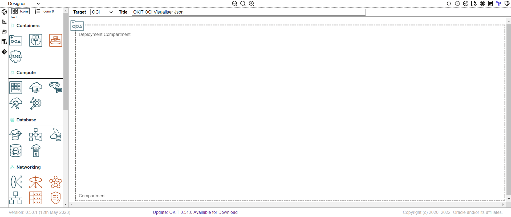
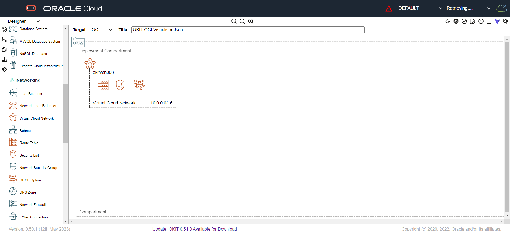
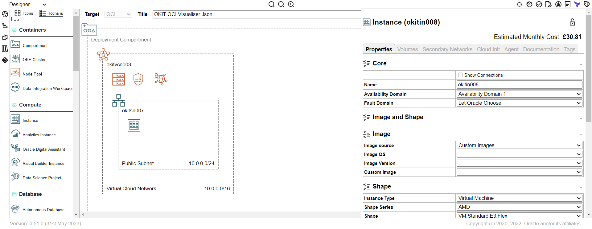
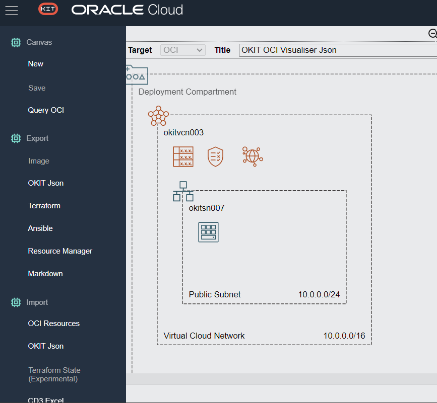
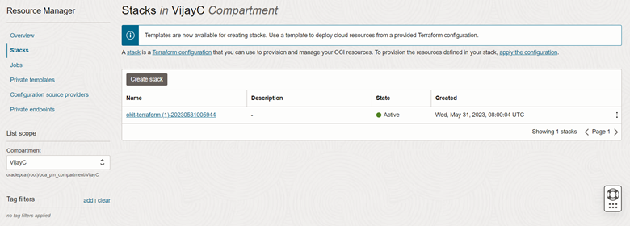
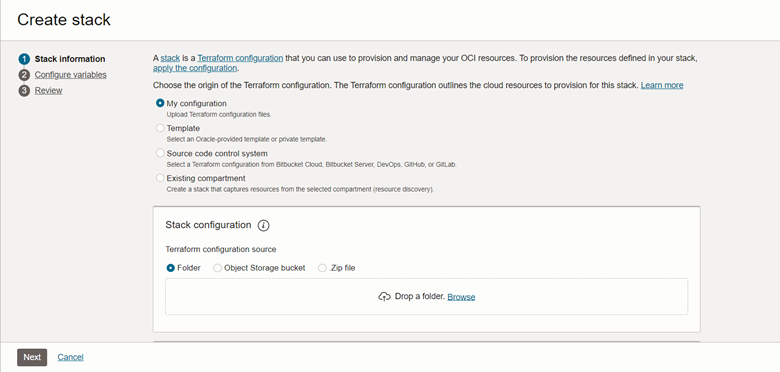
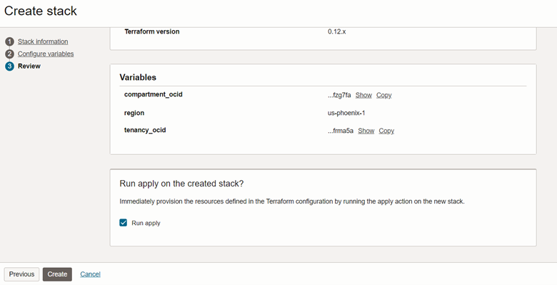
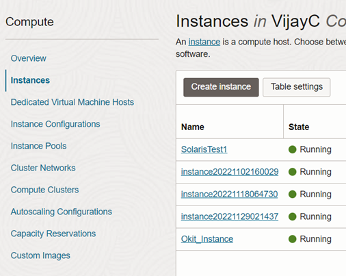

# Create Oracle Solaris 11.4 Instance in OCI using OCI Designer Toolkit (OKIT)

Prior to constructing your OCI Infrastructure, it is necessary to invest time in designing and visualizing the architecture. Several tools such as Microsoft Visio and Draw.io can be utilized for this purpose; however, they are limited to generating diagrams and do not encompass crucial details needed for implementing the design effectively. We can overcome these significant drawbacks of traditional design tools by using OKIT.

OKIT, also known as the OCI Designer Toolkit, is an Open Source, standalone/offline, browser-based drag-and-drop design tool specifically designed for OCI. It enables swift design and prototyping of OCI-based infrastructure. Once the design phase is complete, OKIT has the capability to generate Terraform/Ansible scripts, which can be executed to construct the infrastructure as per the designed specifications.

In this blog, I’ll provide you with the basic overview on how to create an oracle Solaris 11.4 instance in OCI using OKIT, without getting into the particulars of OKIT installation and configuration. 

**Install OCI Designer Toolkit (OKIT)**

Install OKIT by following the steps provided in the [OCI Designer Toolkit Installation Guide](https://github.com/oracle/oci-designer-toolkit/blob/master/documentation/Installation.md). This GitHub repo has detailed explanation on how to install OKIT and execute within a Container (Docker/Lima/Vagrant), Native (Oracle Linux/MacOS/Windows10) or you can build directly from the source.

**Launch OKIT and create an infrastructure diagram**

On the left side, you can see a palette displaying all the OCI artifacts and a canvas in the center with compartment already added in it.

Clicking the icon from palette will allow you to drag it onto the canvas. Drag VCN icon from the palette to the canvas in the middle as shown below:

Now, from the left palette, drag and drop subnet icon into the VCN, and drag and drop Instance icon into the subnet in the center canvas. Each artifact has its own set of properties that are required to build them within OCI. Edit the properties as required for your infrastructure. Select the appropriate Availability Domain, Fault Domain and shape details. For Image selection, select Custom Images from the drop-down and select your Oracle Solaris custom image. 

Please refer to this blog [Building Custom Solaris Images for Oracle CIoud Infrastructure](https://blogs.oracle.com/solaris/post/building-custom-solaris-images-for-oracle-cloud-infrastructure) to create your own custom image. 

After building the infrastructure, we can export it to OCI as a Terraform/ Ansible scripts or resource manager. Click on the hamburger icon on the left side and you can see many options including Canvas, Export, and Import. I’ve selected the Terraform as the export option.

After exporting the terraform scripts, login to your OCI portal navigate to Stacks. Click on the “Create Stack” 

Upload all the terraform configuration files which you have exported from OKIT and proceed to (2) configure variables and edit your compartment_ocid, region, tenancy_ocid, and user_ocid if necessary, and to (3) Review and click the check box to immediately provision the instance.

This will now launch the instance and after a short while you will be able to access your instance.

Please visit [oraclesolaris-contrib](https://github.com/oracle/oraclesolaris-contrib) GitHub repository to stay up-to-date with the latest developments and access more detailed information about Oracle Solaris 11.4 and Oracle Solaris 11.4 on OCI.

Copyright (c) 2020, 2023 Oracle and/or its affiliates.

Released under the Universal Permissive License v1.0 as shown at

[https://oss.oracle.com/licenses/upl/](https://oss.oracle.com/licenses/upl/)