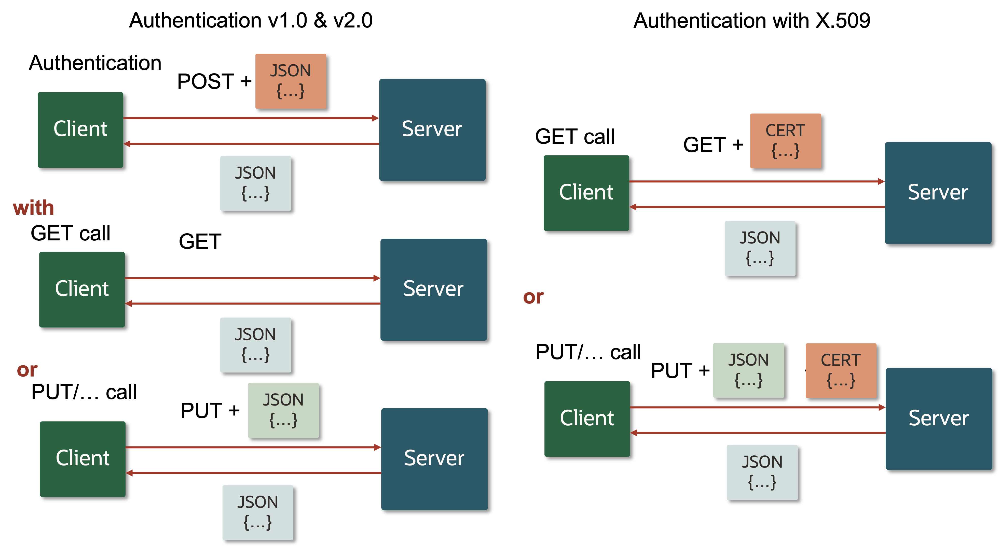

# Using the X.509 Client Certificate for RAD/REST

Starting with Oracle Solaris 11.4 SRU33, we now have the support for connecting to Oracle Solaris over REST using the X.509 client certificate.

Initially the Oracle Solaris RAD/REST API authentication only supported two types of authentication:

* **Authentication v1.0** — a single POST to the authentication URI `https://<system>:<port>/api/authentication/1.0/Session/` with a JSON block that contains both the username and password you want to authenticate against. 
* **Authentication v2.0** — a two-step process with an initial POST to the authentication URI  `https://<system>:<port>/api/authentication/2.0/Session/` with a JSON block that contains the username, and on success is followed up with one or more additional POST to the same URI with a JSON block that contains the response. 

The first is better for applications and scripts that want to connect to the REST interface, the second is better for more interactive uses where for example you'd want a user to type in their username, maybe use two factor authentication and then send their response in a second step. [Here's more information] about using either of these methods.

The downside of using either of these methods is that they are only the first step in a session where you authenticate and then in subsequent calls run the actual queries you're interested in. And this generally is fine for a scripted connection where you've written the script yourself and you know what you want to retrieve and how long the session will last. However in some cases you can't. For example many agents that support making a connection over REST don't have the concept of using a username and password combination, and they're not going to be making a whole set of calls in a single session. They often make a single call at a regular interval and want to close the session directly afterwards. For these types of connection you can leverage the X.509 client certificate. 



**Figure 1 — Using Authentication v1.0 and v2.0 versus Authentication with X.509**

Connecting to Oracle Solaris over REST using the **X.509 client certificate** means you can simply make the GET, PUT, POST, or DELETE call you wanted to make accompanied with a X.509 certificate and key file attached to the call. And it is this certificate and key file that authenticates you on the system. This way the client only makes one call and does the authentication and data request or transfer in the single call, greatly simplifying things. Of course you can also use this when writing a script if you prefer. 

## How is it Set Up?

On the Oracle Solaris side you first need to ensure you're at the level of Oracle Solaris 11.4 SRU33 or later. If you are not you'll need to update. Once you've updated the CA certificate Oracle Solaris is using is probably still at the level from before the update, which would mean that even though Oracle Solaris includes the ability to use X.509 client certificates the certificate doesn't reflect this yet. So you may need to recreate the certificate. To test this run:

```bash
# pktool list keystore=file dir=/etc/certs/localhost
Certificates:
1) X.509 certificate
        Filename: /etc/certs/localhost/host.crt
        Subject: CN=t8-1.example.com
        Issuer: O=Host Root CA, CN=t8-1.example.com
        Not Before: Jul  9 14:36:00 2021 GMT
        Not After: Jul  9 14:36:00 2022 GMT
        Serial: 0x10303EEEA07B
        Signature Algorithm: sha256WithRSAEncryption
        X509v3 Subject Alternative Name:
                DNS:t8-1.example.com
                DNS:t8-1
                IP Address:10.134.xx.xx
        X509v3 Extended Key Usage:
                TLS Web Server Authentication
                TLS Web Client Authentication
        SHA1 Certificate Fingerprint:
                39:4f:9f:f0:a8:a7:e0:a1:85:a9:49:07:fc:13:6f:8c:1c:08:xx:xx
```

If the system has been update but the output doesn't list ` TLS Web Client Authentication` in the `X509v3 Extended Key Usage` section it means the certificate on the system needs to be recreated. For more information please refer to the **Updating the Host Certificate** section below.

### Authenticating as the `root` User

If you want to connect to the system as the `root` user you will need to do one more step to tell the RAD/REST daemon to allow this:

```bash
# svccfg -s rad:remote setprop https_port/map_host_certificate_to_root=boolean: true
# svcadm refresh rad:remote
# svcadm restart rad:remote
```

This this sets the `https_port/map_host_certificate_to_root`  to `true`.  

Of course better is to not use the `root` user at all and if needed assign the relevant rights profile to a regular user to give them the additional privileges or authorizations they may need. In this way using the principle of least privileges to limit what they can do. Note that for the majority of the tasks the privileges and authorizations that come with a normal user will be enough to do this task or get this information.

The Oracle Solaris server is now ready.

## Setting up a Connection

Most production systems with have a centrally signed certificate and there is a central tool where you can generate your own X.509 client certificate and key to use authenticate with, if this is not the case please see the section on **Creating the X.509 Client Certificate and Key** below how to do this.

In the case of the X.509 Client authentication works subtly different than in the cases it supported before. In stead of sending a user name and password over the wire, in one or two steps, in this case you present the application that is going to make the authorized connection the certificate and key files, which it uses to construct its own authorization request. This means the key and certificate never leave the system and remain hidden.

The way you use the certificate and key works much in the same way though, like with the username/password case you give these to the application in your configuration (file) and then the application knows what to do with it.

Here is an example of connecting using the Python Requests library to get information about which Zones are installed on the system:

```python
>>> import requests
>>> import json
>>> from pprint import pprint
>>> r  = requests.get('https://t8-1.example.com:6788/api/com.oracle.solaris.rad.zonemgr/1.8/Zone?_rad_detail', cert=('my_user.crt', 'my_user.key'))
>>> pprint(json.loads(r.text))
{'payload': [{'Zone': {'auxstate': [],
                       'brand': 'solaris',
                       'id': -1,
                       'name': 'orion',
                       'state': 'installed',
                       'uuid': '825c5957-e427-405a-94af-81364849ea8d'},
              'href': 'api/com.oracle.solaris.rad.zonemgr/1.8/Zone/orion'},
             {'Zone': {'auxstate': [],
                       'brand': 'solaris',
                       'id': -1,
                       'name': 'libra',
                       'state': 'installed',
                       'uuid': '98110f59-671c-45ac-bbd1-beba0f58e9fe'},
              'href': 'api/com.oracle.solaris.rad.zonemgr/1.8/Zone/libra'}],
 'status': 'success'}
```

In this example the `cert=('my_user.crt', 'my_user.key')` argument is passed to point to the location of the certificate and key files together with the `GET` call to the Zones RAD/REST API endpoint, and you get the answer in one go. You don't need to first start the session by authenticating as this user, and then use the session to make the call to the Zones API, greatly simplifying things. Note that in this example file both files are in the current working directory.

 Similarly in the case of a ElasticSearch Beats HTTP agent, you can configure the certificate and key file locations in the `modules.d/http.yml` file:

```yaml
# Module: http
# Docs: https://www.elastic.co/guide/en/beats/metricbeat/7.13/metricbeat-module-http.html

- module: http
  metricsets:
    - json
  period: 10s
  hosts: ["https://t8-1.example.com:6788"]
  namespace: "json_namespace"
  path: "/api/com.oracle.solaris.rad.zonemgr/1.8/Zone"
  query: 
    _rad_detail: true
  ssl.certificate_authorities: ["/home/demo/hostca.crt"]
  ssl.certificate: "/home/demo/my_user.crt"
  ssl.key: "/home/demo/my_user.key"
```

Note that in this case I'm also configuring `ssl.certificate_authorities` to the location of the `hostca.crt` file from the Oracle Solaris server because in this case it's a self signed host certificate which the system the Beats agent is running on doesn't know. This way the Beats agent knows that it can trust the Oracle Solaris server. The `hostca.crt` file can be found in `/etc/certs/localhost/host-ca/` on the Oracle Solaris server.

Also note that where in the Python code the additional query `?_rad_detail` is at the end of the URI, the Beats agent has this in a separate section `query: ` and sets the query by using `_rad_detail: true`. This is not related to the X.509 Client but is useful to know when using RAD/REST in these types of tools.

## Updating the Host Certificate

In the case your system is already at Oracle Solaris 11.4 SRU33 or later but is not showing `TLS Web Client Authentication` in the `X509v3 Extended Key Usage` section, the `pktool` output probably looks like this:

```bash
# pktool list keystore=file dir=/etc/certs/localhost
Certificates:
1) X.509 certificate
        Filename: /etc/certs/localhost/host.crt
        Subject: CN=t8-1.example.com
        Issuer: O=Host Root CA, CN=t8-1.example.com
        Not Before: Feb 19 20:46:00 2020 GMT
        Not After: Feb 16 20:46:00 2030 GMT
        Serial: 0x10303EEEA07B
        Signature Algorithm: sha256WithRSAEncryption
        X509v3 Subject Alternative Name:
                DNS:t8-1.example.com
        X509v3 Extended Key Usage:
                TLS Web Server Authentication
        SHA1 Certificate Fingerprint:
                ad:9b:68:8e:fd:d0:cc:98:13:e7:12:70:2b:30:f7:52:f6:92:xx:xx
```

In this example the default host generated CA certificate is used, see [idenity(8)](https://docs.oracle.com/cd/E88353_01/html/E72487/identity-8.html) for details on using certificates from an external CA. To recreate the certificate for a self signed CA certificate run:

```bash
# svccfg -s system/identity:cert delcust
# svcadm refresh system/identity:cert
# svcadm restart -s system/identity:cert
```

Now looking at the cert again:

``` bash
# pktool list keystore=file dir=/etc/certs/localhost
Certificates:
1) X.509 certificate
        Filename: /etc/certs/localhost/host.crt
        Subject: CN=t8-1.example.com
        Issuer: O=Host Root CA, CN=t8-1.example.com
        Not Before: Jul  9 14:36:00 2021 GMT
        Not After: Jul  9 14:36:00 2022 GMT
        Serial: 0x10303EEEA07B
        Signature Algorithm: sha256WithRSAEncryption
        X509v3 Subject Alternative Name:
                DNS:t8-1.example.com
                DNS:t8-1
                IP Address:10.134.xx.xx
        X509v3 Extended Key Usage:
                TLS Web Server Authentication
                TLS Web Client Authentication
        SHA1 Certificate Fingerprint:
                39:4f:9f:f0:a8:a7:e0:a1:85:a9:49:07:fc:13:6f:8c:1c:08:xx:xx
```

This now shows the support for the TLS Web Client Authentication. 

In the case the certificate was not self signed your signing authority might need to recreate the CA certificate.

## Creating the X.509 Client Certificate and Key

In the case your systems are not using a central CA to create the host CA certificate and the X.509 Client certificate and key you will need to create your own. This could for example be because you have a demo system, or a proof of concept. Here is an overview of the steps you'd need to take:

* Create a private `.key` file and `.csr` file on the client system.
* Copy the `.csr` file to the Oracle Solaris server.
* Using the `.csr` file and the server's `hostca.crt` create a new `.crt` certificate file.
* Copy the `.crt` file back over to the client system.
* Use the `.key` and `.crt` files to connect to the server.

### Creating the `.key` and `.csr` files

There are quite a few ways to do this, in this example we're going to use the `openssl` command and we're going to create a `my_user.key` and a `my_user.csr` file, where the username we're embedding in the key is `demo`:

```bash
[demo@localhost certs]$ openssl req -new -newkey rsa:2048 -nodes -keyout my_user.key -out my_user.csr -subj "/UID=demo"
Generating a RSA private key
......+++++
............................................+++++
writing new private key to 'my_user.key'
-----
```

We do this on the client system so it has the `.key` file and it can stay on this system. Note that we didn't add any IP address or system name to the `-subj` option, this means it's use is more flexible.

### Copying the `.csr` file

Now we can copy the `my_user.csr` file we just generated to the Oracle Solaris system so we can use it there to create a `.crt` file:

```bash
[demo@localhost certs]$ rsync -au my_user.csr demo@t8-1.example.com:.
Password: 
```

### Creating a new `.crt` file

Now on the Oracle Solaris system, become the `root` user or assume the `root` role. This is needed to be able to read the `/etc/certs/localhost/host-ca/hostca.key` file. Change directory into `/etc/certs/localhost/host-ca/`, create a random serial number, and then run the `pktool` command from within this directory: 

```bash
root@t8-1:~# cd /etc/certs/localhost/host-ca/
root@t8-1:/etc/certs/localhost/host-ca# serial_number="$(od -An -N6 -x /dev/urandom | nawk '{print $1$2$3;}')"
root@t8-1:/etc/certs/localhost/host-ca# pktool signcsr keystore=file signkey=hostca.key outcert=/export/home/demo/my_user.crt csr=/export/home/demo/my_user.csr issuer="O=Host Root CA, CN=t8-1.example.com" serial=$serial_number
```

Note the `CN=t8-1.example.com` has to be the same as in the `Subject:` line in the response to the `pktool list keystore=file dir=/etc/certs/localhost` command. 

### Copying the `.crt` file back over

Now copy the `my_user.crt` file back over to the client. You will also need to copy the `/etc/certs/localhost/host-ca/hostca.crt` file across to validate the connection from the client:

```bash
[demo@localhost certs]$ rsync -au demo@t8-1.example.com:my_user.crt my_user.crt
Password:
[demo@localhost certs]$ rsync -au demo@t8-1.example.com:/etc/certs/localhost/host-ca/hostca.crt hostca.crt
Password:
```

### Using the `.key` and `.crt` files

Now we have all the files we need we can connect to the server and run a REST request:

```python
>>> import requests
>>> import json
>>> from pprint import pprint
>>> r  = requests.get('https://t8-1.example.com:6788/api/com.oracle.solaris.rad.zonemgr/', cert=('my_user.crt', 'my_user.key'), verify = 'hostca.crt')
>>> pprint(json.loads(r.text))
{'payload': [{'Zone': {'auxstate': [],
                       'brand': 'solaris',
                       'id': -1,
                       'name': 'orion',
                       'state': 'installed',
                       'uuid': '825c5957-e427-405a-94af-81364849ea8d'},
              'href': 'api/com.oracle.solaris.rad.zonemgr/1.8/Zone/orion'},
             {'Zone': {'auxstate': [],
                       'brand': 'solaris',
                       'id': -1,
                       'name': 'libra',
                       'state': 'installed',
                       'uuid': '98110f59-671c-45ac-bbd1-beba0f58e9fe'},
              'href': 'api/com.oracle.solaris.rad.zonemgr/1.8/Zone/libra'}],
 'status': 'success'}
```

This should allow you to set up a connection with a system that doesn't have a centrally signed certificate.

For reference:

https://docs.oracle.com/cd/E88353_01/html/E72487/identity-8.html

https://docs.oracle.com/cd/E37838_01/html/E68270/gpztv.html

Copyright (c) 2022, Oracle and/or its affiliates. Licensed under the Universal Permissive License v 1.0 as shown at <https://oss.oracle.com/licenses/upl/>.