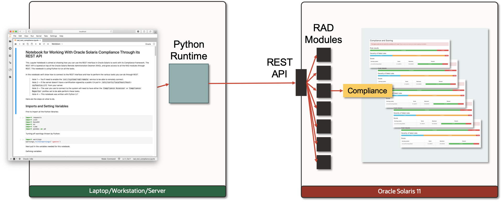

## Using the Solaris Compliance REST API Notebook

The Solaris Compliance Framework allows you to assess the current state of the Solaris instance against a certain assessment profile. This assessment profile is a set of tests defined in a Compliance Benchmark. Oracle Solaris ships with two security benchmarks: Solaris (the recommended security configuration), and PCI-DSS (the benchmark for the Payment Card Industry). Each of these benchmarks ships with their own profiles. Optionally you can tailor your profile to the needs on the specific system you're going to assess. For more information on the Solaris Compliance Framework please refer to the [Oracle® Solaris 11.4 Compliance Guide](https://docs.oracle.com/cd/E37838_01/html/E61020/index.html).

The Compliance RAD/REST module allows you to connect to the Compliance Framework and do the following things:

- List Reports
  - Get basic data on reports
  - Download full reports
- Run new compliance assessments
  - Controlling name, benchmark, and profile that is used in the new assessment
- Delete reports
- Get info on benchmarks, profiles, and tailorings
  - List available benchmarks, and their profiles and tailorings
  - Get info on individual benchmark rules and what they test 

This [Jupyter notebook](rad_rest_compliance.ipynb) will show how to do all of these steps.

Copyright (c) 2020, Oracle and/or its affiliates. Licensed under the Universal Permissive License v 1.0 as shown at <https://oss.oracle.com/licenses/upl/>.