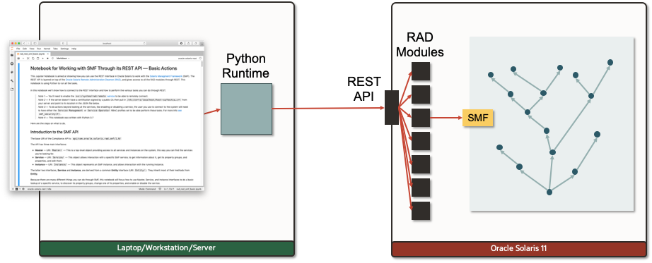

## Using the Solaris SMF REST API Notebook

The Oracle Solaris Service Management Facility (SMF) controls all the services running on the Oracle Solaris instance. SMF manages critical system services essential to the working operation of the system and manages application services such as a database or Web server. SMF improves the availability of a system by ensuring that essential system and application services run continuously even in the event of hardware or software failures. It also holds most of the configuration of these services. This way all the services on the system have defined dependencies and it ensures the system starts cleanly and remains stable as possible, even if there are outages.

For more information on SMF please refer to the [Managing System Services in Oracle® Solaris 11.4 guide](https://docs.oracle.com/cd/E37838_01/html/E60998/index.html).

This notebook uses the SMF RAD/REST module to connect to SMF and do some basic tasks like get the list of SMF services, alter a service property, and enable and disable a service.

The full SMF RAD/REST module allows for much more functions at a high level it allows to do the following things:

- List SMF services
  - Get basic data on each service
  - Get basic data on each service instance
- Read and configure services
  - Get and set property groups and properties
  - Validate certain properties are set
  - Get service dependencies
  - Work with service decorations, templates, and snapshots.
- Control the service instances
  - Enable and disable service instances
  - Restart, refresh, and clear service instances
  - Get info on the current and next service instance state
- And more

For the full list of interfaces please see the documentation as part of the `webui-docs` package. Please see  the [Managing Oracle Solaris through REST](../../../README.md) article for more information on how to access this.

Copyright (c) 2020, Oracle and/or its affiliates. Licensed under the Universal Permissive License v 1.0 as shown at <https://oss.oracle.com/licenses/upl/>.