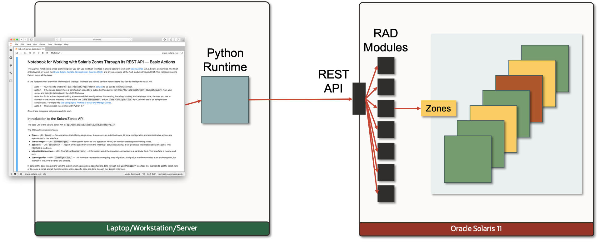

## Using the Oracle Solaris Zones REST API Notebook

The Oracle Solaris Zones (a.k.a. Solaris Containers) allow you to run many lightweight virtual environments on a single system, completely and safely virtualizing and isolating all the system namespaces and resources. This way giving you the ability to fully isolate your applications from each other while dynamically sharing the underlying system resources. 

Solaris Zones are quick and easy to set up and install and can be customized into environments as complex and diverse as your applications may need. They can even be locked down into full or partial read/only runtime enviroments for highly secure situations.

For more information on Solaris Zones please refer to the [Oracle Solaris Zones Overview](https://docs.oracle.com/cd/E37838_01/html/E61037/zonesoverview.html).

The Solaris Zones RAD/REST module allows you to connect to the system hosting Solaris Zones and do the following things:

- List zones
  
  - Get a full list of the zones and their state
  - Get basic data on each zone
  - Get detailed data on each zones’ properties
  
- Control full zones lifecycle
  
  - Create/install/boot/halt/shutdown/uninstall/delete the zones on the system
  - (Live) reconfigure of the zones’ properties 
  - Pull properties from one zone and copy them to another zone
  
- Control zone migration

  - Initiate both live and cold migration
  - Detach and and attach zones
  - Initiate zones evacuation

The [Jupyter notebook](rad_rest_zones_basic.ipynb) will show how to connect to the hosting system and do the basic steps of investigating the zones on the system and how to do basic lifecycle tasks like creating/installing/booting/halting/uninstalling/deleting zones on the system.

Copyright (c) 2020, Oracle and/or its affiliates. Licensed under the Universal Permissive License v 1.0 as shown at <https://oss.oracle.com/licenses/upl/>.